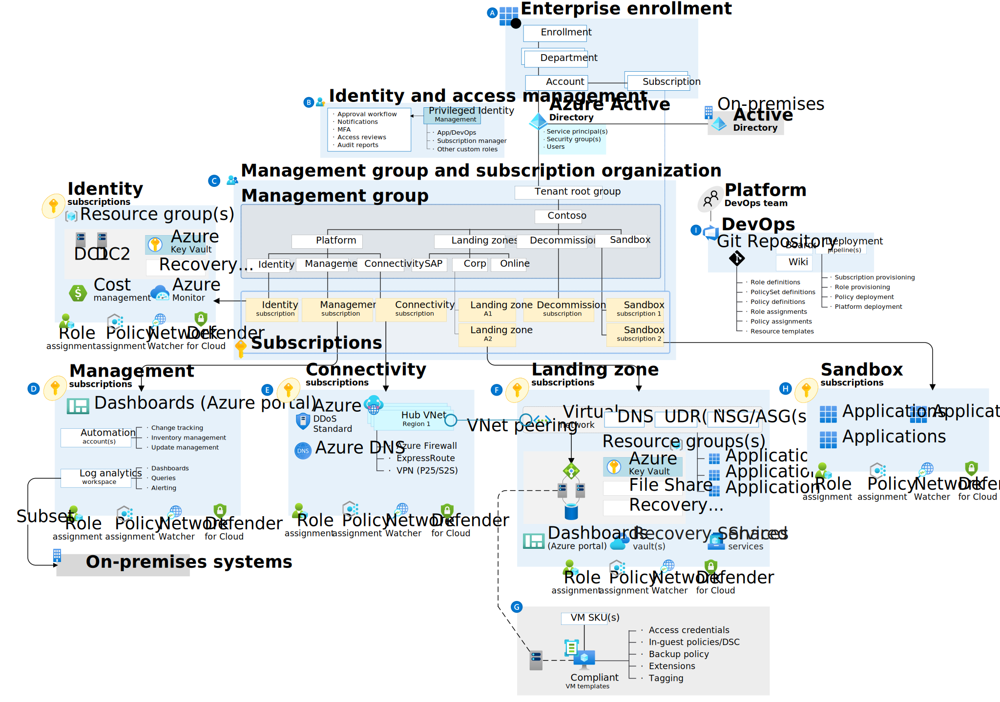
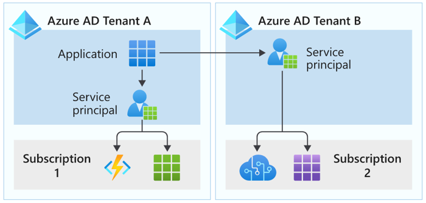
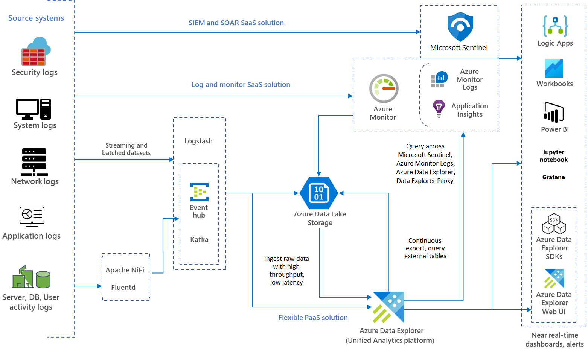

# MS-Learn notes AZ-305

## Index
- [MS-Learn notes AZ-305](#ms-learn-notes-az-305)
  - [Index](#index)
  - [Governance](#governance)
    - [Management Groups](#management-groups)
    - [Subscriptions](#subscriptions)
    - [Resource Groups](#resource-groups)
    - [Resource Tags](#resource-tags)
      - [Table with Resource tag examples](#table-with-resource-tag-examples)
    - [Azure Policy](#azure-policy)
    - [Role-Based Access Control (RBAC)](#role-based-access-control-rbac)
    - [Landing Zones](#landing-zones)
    - [Links related to Architecting, Governance and Landing Zones](#links-related-to-architecting-governance-and-landing-zones)
  - [Authentication and authorization](#authentication-and-authorization)
    - [Azure AD B2B](#azure-ad-b2b)
    - [Azure AD B2C](#azure-ad-b2c)
      - [Comparision between B2B to B2C](#comparision-between-b2b-to-b2c)
    - [Conditional Access](#conditional-access)
    - [Managed Identities](#managed-identities)
    - [Service principals for applications](#service-principals-for-applications)
    - [Key Vault](#key-vault)
  - [Monitor](#monitor)
    - [Overview of Azure Monitor](#overview-of-azure-monitor)
    - [Characteristics of Azure Monitor](#characteristics-of-azure-monitor)
    - [Billing](#billing)
    - [Things to consider when using Azure Monitor Logs workspaces](#things-to-consider-when-using-azure-monitor-logs-workspaces)
    - [Recommendations](#recommendations)
    - [Azure Workbooks](#azure-workbooks)
    - [Azure Data Explorer](#azure-data-explorer)
  - [Networking](#networking)
    - [Virtual Network (vNET)](#virtual-network-vnet)
      - [Address space](#address-space)
  - [Design business continuity](#design-business-continuity)
    - [SLA uptime level table](#sla-uptime-level-table)
    - [Availability metrics](#availability-metrics)
    - [Azure Front Door](#azure-front-door)
      - [High availability solutions for Azure Front Door](#high-availability-solutions-for-azure-front-door)
    - [Azure Traffic Manager](#azure-traffic-manager)
      - [High availability scenarios for Azure Traffic Manager](#high-availability-scenarios-for-azure-traffic-manager)
      - [Example of Active/Passive scenario with Traffic Manager](#example-of-activepassive-scenario-with-traffic-manager)
    - [High Availability for Compute](#high-availability-for-compute)
      - [Availability zones](#availability-zones)
      - [VM HA options](#vm-ha-options)
      - [Zonal architucture](#zonal-architucture)
      - [Zone-redundant architecture](#zone-redundant-architecture)
    - [Virtual Machine Scale set options](#virtual-machine-scale-set-options)
    - [Highly Available Container solution](#highly-available-container-solution)
      - [Describe Azure Storage replication options for AKS](#describe-azure-storage-replication-options-for-aks)
      - [Consider Azure Backup or Velero for AKS data](#consider-azure-backup-or-velero-for-aks-data)
    - [HA for relational data](#ha-for-relational-data)
      - [Azure SQL](#azure-sql)
        - [General Purpose](#general-purpose)
        - [Business Critical](#business-critical)
        - [Hyperscale](#hyperscale)
      - [Azure SQL SLA](#azure-sql-sla)
      - [Active geo-replication for SQL](#active-geo-replication-for-sql)
      - [Compare geo-replication to failover groups](#compare-geo-replication-to-failover-groups)
    - [Storage Redundancy](#storage-redundancy)
      - [Redundancy options](#redundancy-options)
        - [Summary of storage redundancy options](#summary-of-storage-redundancy-options)
    - [Useful links](#useful-links)

## Governance

### Management Groups

- A management group tree can support up to six levels of depth. This limit doesn't include the tenant root level or the subscription level.
- **Design management groups with governance in mind.** Use Azure policies at the management group level for all workloads that require the same security, compliance, connectivity, and feature settings.
- **Consider a top-level management group.** Implement a top-level management group to support common platform policy and Azure role assignments across the entire organization. A Tailwind Traders management group can be a top-level management group for all organizational-wide policies

### Subscriptions

- **Treat subscriptions as a democratized unit of management.** Align your subscriptions to meet specific company business needs and priorities.
- **Group subscriptions together under management groups.** Group together subscriptions that have the same set of policies and Azure role assignments to inherit these settings from the same management group.
- **Consider a dedicated shared services subscription.** Use a shared services subscription to ensure all common network resources are billed together and isolated from other workloads. Examples of shared services subscriptions include Azure ExpressRoute and Virtual WAN.
- **Consider subscription scale limits.** Subscriptions serve as a scale unit for component workloads. Large, specialized workloads like high-performance computing, IoT, and SAP are all better suited to use separate subscriptions. By having separate subscriptions for different Tailwind Traders groups or tasks, you can avoid resource limits (such as a limit of 50 Azure Data Factory integrations).
- **Consider administrative management.** Subscriptions provide a management boundary, which allows for a clear separation of concerns. Will each subscription for your company need a separate administrator, or can you combine subscriptions?
- **Consider how to assign Azure policies.** Both management groups and subscriptions serve as a boundary for the assignment of Azure policies
- **Consider network topologies.** Virtual networks can't be shared across subscriptions. Resources can connect across subscriptions with different technologies, such as virtual network peering or Virtual Private Networks (VPNs).

### Resource Groups

- Resources in the resource group can be in different regions.
- Resource groups can't be nested.
- Each resource must be in one, and only one, resource group.
- Resource groups can't be renamed.
- **Consider resource life cycle.** Design your resource groups according to life cycle requirements. Do you want to deploy, update, and delete certain resources at the same time? If so, place these resources in the same resource group.

### Resource Tags

Consider the type of tagging required. Plan to use different types of resource tags to support the Tailwind Traders organization. Resource tags generally fall into five categories: 

1. functional
2. classification
3. accounting
4. partnership
5. purpose.

#### Table with Resource tag examples

| Tag type       | Description                                                                                                                                                                                | Example name-value pairs                                                                  |
|----------------|--------------------------------------------------------------------------------------------------------------------------------------------------------------------------------------------|-------------------------------------------------------------------------------------------|
| Functional     | Functional tags categorize resources according to their purpose within a workload. This tag shows the deployed environment for a resource, or other functionality and operational details. | - app = catalogsearch1 - tier = web - webserver = apache - env = production, dev, staging |
| Classification | Classification tags identify a resource by how it's used and what policies apply to it.                                                                                                    | - confidentiality = private - SLA = 24hours                                               |
| Accounting     | Accounting tags allow a resource to be associated with specific groups within an organization for billing purposes.                                                                        | - department = finance - program = business-initiative - region = northamerica            |
| Partnership    | Partnership tags provide information about the people (other than IT members) who are associated with a resource, or otherwise affected by the resource.                                   | - owner = jsmith - contactalias = catsearchowners - stakeholders = user1;user2;user3      |
| Purpose        | Purpose tags align resources to business functions to better support investment decisions.                                                                                                 | - businessprocess = support - businessimpact = moderate - revenueimpact = high            |

### Azure Policy

The following events or times trigger an evaluation:

- A resource is created, deleted, or updated in scope with a policy assignment.
- A policy or an initiative is newly assigned to a scope.
- An assigned policy or initiative for a scope is updated.
- The standard compliance evaluation cycle (occurs once every 24 hours).

### Role-Based Access Control (RBAC)

A user's identity goes through several phases:

1. Initially, the user has no access. 
2. Access can be granted through RBAC and verified with Azure AD conditional access. 
3. Azure AD Identity Protection can be used to monitor the user's access. 
4. Periodically, Azure AD access reviews confirm the access is still required.

Things to consider when using Azure RBAC

- Consider the highest scope level for each requirement
- Consider the access needs for each user.
- Consider assigning roles to groups, and not users.
- Consider when to use Azure policies
  - By using a combination of Azure policies and Azure RBAC, you can provide effective access control

### Landing Zones

Things to know about Azure landing zones

- Landing zones are defined by management groups and subscriptions that are designed to scale according to business needs and priorities.
- Azure policies are associated with landing zones to ensure continued compliance with the organization platform.
- Landing zones are pre-provisioned through code.
- A landing zone can be scoped to support application migrations and development to scale across the organization's full IT portfolio.
- The Azure landing zone accelerator can be deployed into the same Azure AD tenant for an existing Azure architecture. The accelerator is an Azure-portal-based deployment.

Landing zone example:

### Links related to Architecting, Governance and Landing Zones

- [Resource naming and tagging decision guide](https://learn.microsoft.com/en-us/azure/cloud-adoption-framework/decision-guides/resource-tagging/?toc=%2Fazure%2Fazure-resource-manager%2Fmanagement%2Ftoc.json)
- [Define your naming convention](https://learn.microsoft.com/en-us/azure/cloud-adoption-framework/ready/azure-best-practices/resource-naming)
- [Abbreviation examples for Azure resources](https://learn.microsoft.com/en-us/azure/cloud-adoption-framework/ready/azure-best-practices/resource-abbreviations)
- [Azure Naming Tool](https://github.com/microsoft/CloudAdoptionFramework/tree/master/ready/AzNamingTool)
- [Azure Blueprints documentation](https://learn.microsoft.com/en-us/azure/governance/blueprints/)
- [Recommended policies for Azure services](https://learn.microsoft.com/en-us/azure/governance/policy/concepts/recommended-policies)
- [Landing zone implementation options](https://learn.microsoft.com/en-us/azure/cloud-adoption-framework/ready/landing-zone/implementation-options)
- [Azure landing zone accelerator](https://learn.microsoft.com/en-us/azure/cloud-adoption-framework/ready/landing-zone/#azure-landing-zone-accelerator)

## Authentication and authorization

### Azure AD B2B

- Consider designating an app owner to manage guest users
- Consider conditional access policies to control access
- Consider the benefits of using MFA

### Azure AD B2C

Azure AD B2C is a type of Azure AD tenant for managing customer identities and their access to your apps. Azure AD B2C requires an Azure AD tenant, but this tenant isn't the same as the Azure AD tenant for your organization.

- The Azure AD tenant represents your organization.
- The Azure AD B2C tenant represents the identities for your customer apps

#### Comparision between B2B to B2C

|                                           | **Azure AD B2B (business-to-business)**                                                                                                                                                                                                         | **Azure AD B2C (business-to-customer)**                                                                                                                                                                                                          |
|-------------------------------------------|-------------------------------------------------------------------------------------------------------------------------------------------------------------------------------------------------------------------------------------------------|--------------------------------------------------------------------------------------------------------------------------------------------------------------------------------------------------------------------------------------------------|
| Define your focus                         | Tailwind Traders wants to collaborate with business partners from external organizations like suppliers, partners, and vendors. You'll support users as guest users in your directory, and they might or might not have managed IT.             | Tailwind Traders wants to engage with customers of their products. You'll manage users in a separate Azure AD directory / tenant.                                                                                                                |
| Identify your users                       | Your users will represent a Tailwind Traders partner company, or be employees of Tailwind Traders.                                                                                                                                              | Your users will be customers of Tailwind Traders who represent themselves.                                                                                                                                                                       |
| Manage user profiles                      | Tailwind Traders will manage partner user profiles through access reviews, email verification, or access and blocklists.                                                                                                                        | Customer users of Tailwind Traders will manage their own profiles.                                                                                                                                                                               |
| Store user information                    | You'll manage external users in the same directory as Tailwind Traders employees, but the external users will typically be annotated as guest users. Guest users can be managed the same way as employees, added to the same groups, and so on. | You'll manage external users in the Azure AD B2C directory. They're managed separately from the Tailwind Traders employee and partner directory (if any).                                                                                        |
| Enable user discovery and support privacy | Partner users of Tailwind Traders will be discoverable and they can find other users from their organization.                                                                                                                                   | Customer users of Tailwind Traders will be invisible to other users. Privacy and content will be enforced.                                                                                                                                       |
| Work with identity providers              | External users will collaborate by using work accounts, school accounts, any email address, SAML and WS-Fed based identity providers, Gmail, and Facebook.                                                                                      | Consumer users with local app accounts (any email address or user name), various supported social identities, and users with corporate and government-issued identities via SAML/WS-Fed based identity provider federation will access the apps. |
| Customize UI and support branding         | You expect to use customized UI branding for the host or inviting organization (Tailwind Traders).                                                                                                                                              | You want the branding to be fully customizable per app or organization and not specific to Tailwind Traders.                                                                                                                                     |

### Conditional Access

- Consider MFA for more granular control
- Consider preventing access from specific geographic areas
- Consider access only from managed devices
- Consider access only from approved client apps
- Consider using policies to handle compromised accounts
  - Require all users to register for MFA
  - Require a password change for users who are high-risk
  - Require MFA for users with medium or high sign-in risk
- Consider blocking access
- Consider blocking legacy authentication protocols
- Consider running Report-only mode
- Consider using the What If tool

### Managed Identities

- When you use managed identities, you don't need to rotate credentials or worry about expiring certifications. Azure handles credential rotation and expiration in the background. To configure an app to use a managed identity, you use the provided token to call the service.
- There are two types of managed identities
  - System-assigned - tied to the lifecycle of the azure resource that created it. Can be used only for that Azure resource
  - User-assigned - created as a standalone Azure resource. Can be used by multiple resources and is managed seperately.

### Service principals for applications

There are two ways an app can be represented in Azure AD:

- **Application object** - An app object allows the service to know how to issue tokens to the app based on the object settings. The app object exists only in its home directory, even if it's a multi-tenant app that supports service principals in other directories
- **Service Principal** - The service principal for an app can be considered an instance of an app. Service principals generally reference an app object. One app object can be referenced by multiple service principals across directories

There are three types of service principals:

1. **Application** 
2. **Managed Identity** Managed identities provide an identity for applications to use when connecting to resources that support Azure AD authentication. When a managed identity is enabled, the service principal that represents that managed identity is created in your tenant
3. **Legacy** A legacy service principal represents a legacy app that was created before app registrations were introduced, or an app created through a legacy configuration experience. A legacy service principal can have credentials, service principal names, reply URLs, and other properties that an authorized user can edit. A legacy service principal doesn't have an associated app registration.

Characteristics of app objects and service principals

- An app can have at most one app object, which is registered in a "home" directory.
- An app can have one or more service principal objects that represent instances of the app in every directory in which it acts.
- An app object has a `1:1` relationship with the software app, and a `1:many` relationship with its service principal object(s).
- A service principal must be created in each tenant where the app is used, to establish an identity for sign-in and access to resources secured by the tenant.
- A single-tenant app has only one service principal (in its home tenant) that's created and consented for use during app registration. A multi-tenant app also has a service principal created in each tenant where a user from that tenant has consented to its use.
- Managed identity service principals can be granted access and permissions, but they can't be updated or modified directly.
- Legacy service principals can only be used in the tenant where they're created.

Things to consider

- **Consider how to create your application service principals.** A service principal object for an app can be created in different ways:
  - When an app is given permission to access resources in a tenant (upon registration or consent), a service principal object is created.
  - When you register an app by using the Azure portal, a service principal is created automatically.
  - You can create service principal objects in a tenant by using Azure PowerShell, the Azure CLI, Microsoft Graph, and other tools.
- **Consider service principals without managed identities.** Use service principals without managed identities when you want to be able to manage the credentials.
- **Consider authentication of external apps to Azure resources.** Authenticate external apps to Azure resources by using service principals.
- **Consider the best practices for requesting permissions.** (Recommended) Review these suggestions for how to build apps that use Azure AD to provide sign-in and access tokens for secured endpoints:
  - Only ask for the permissions required for implemented app functionality. Don't request user consent for permissions that you haven't yet implemented for your application.
  - When you request permissions for app functionality, request the least-privileged access. If an app analyzes a user's email, but it takes no action on the mailbox, you shouldn't request the more permissive Mail.ReadWrite permission when the Mail.Read permission is sufficient.
  - Apps should gracefully handle scenarios where the user doesn't grant consent to the app when permissions are requested. In the case where an app doesn't receive an access token with the required permissions, the app should explain the situation to the user with options on how to remedy the issue.
- **Consider restricting user consent.** (Microsoft recommended) Restrict user consent to allow users to consent only for apps from verified publishers, and only for the Tailwind Traders permissions you select. For apps that don't meet this policy, centralize the decision-making process to the security and identity administrator team. After end-user consent is disabled or restricted, there are several important considerations to ensure your organization stays secure while still allowing business-critical applications to be used. These steps are crucial to minimize impact on your organization's support team and IT admins, while preventing the use of unmanaged accounts in third-party applications.

### Key Vault

- Key Vault is available in two service tiers:
  - Standard tier lets you encrypt your data with a software key.
  - Premium tier offers hardware security module (HSM)-protected keys.

Things to consider with key vault:

- Consider shared access signatures for clients. Implement shared access signatures to provide secure delegated access to resources in your Tailwind Traders storage account. With Key Vault shared access signatures, you have granular control over how clients can access your data:
  - Determine which resources the client can access. 
  - Define the client's permissions for those resources.
  - Specify how long the client's shared access signature is valid.

## Monitor

- **Azure Monitor Logs** lets you collect and organize data from resources that you monitor. You configure what data is gathered and how it's organized in the platform. Other features in Azure Monitor automatically store their data in Logs. You can use the stored data with your collected data to help monitor the performance of your environment.
- **Azure Monitor Metrics** captures numerical data from your monitored resources and stores the results in a time-organized database. Metrics are collected at intervals you specify. You can use metrics to check how your system is performing at a particular time or under certain circumstances.

### Overview of Azure Monitor

### Characteristics of Azure Monitor

- Data from multiple resources can be collected into Azure Monitor and analyzed together by using a common set of tools.
- Logs enable complex analysis by using log queries.
- Metrics support near-real-time scenarios like priority alerts and responding to critical issues.
- Monitoring data can be sent to other locations to support certain scenarios, such as tracking and reporting.
- Sources of monitoring data from Azure applications can be organized into tiers, and each tier can be accessed in different ways.
  - The highest tiers are for your application itself.
  - The lower tiers are components of the Azure platform.

Services that require an agent

- Azure Cloud Services
- Azure Virtual Machines
- Azure Virtual Machine Scale Sets
- Azure Service Fabric

### Billing

Excluded columns

- _ResourceId
- _SubscriptionId
- _ItemId
- _IsBillable
- _BilledSize
- Type

Excluded tables

-  AzureActivity
-  Heartbeat
-  Usage
-  Operation

### Things to consider when using Azure Monitor Logs workspaces

- **Consider your access control strategy.** As you plan for how many workspaces to use in the Tailwind Traders organization, consider these potential requirements:
  - Is your organization a global company? Do you need log data stored in specific regions for data sovereignty or compliance reasons?
  - Does your architecture use Azure? Do you want to avoid outbound data transfer charges by having a workspace in the same region as the Azure resources it manages?
  - Does the system support multiple departments or business groups? Each group should access their data and not the data of others. Also, there's no business requirement for a consolidated cross department or business group view.
- **Consider deployment model options.** Most IT organizations use a centralized, decentralized, or hybrid model for their architecture. Consider these common workspace deployment models, and how they might work for the Tailwind Traders organization:

| **Deployment** | **Description**                                                                                                                                                                                                                                                                                                                                                                                                                                                                          |
|----------------|------------------------------------------------------------------------------------------------------------------------------------------------------------------------------------------------------------------------------------------------------------------------------------------------------------------------------------------------------------------------------------------------------------------------------------------------------------------------------------------|
| Centralized    | All logs are stored in a central workspace and administered by a single team. Azure Monitor provides differentiated access per-team. In this scenario, it's easy to manage, search across resources, and cross-correlate logs. The workspace can grow significantly depending on the amount of data collected from multiple resources in your subscription. Extra administrative overhead is needed to maintain access control to different users. This model is known as hub and spoke. |
| Decentralized  | Each team has their own workspace created in a resource group they own and manage. Log data is segregated per resource. In this scenario, the workspace can be kept secure and access control is consistent with resource access. A disadvantage of this module is that it can be difficult to cross-correlate logs. Users who need a broad view of many resources can't analyze the data in a meaningful way.                                                                           |
| Hybrid         | A hybrid approach can be complicated by security audit compliance requirements. Many organizations implement both deployment models in parallel. The hybrid design commonly results in a complex, expensive, and hard-to-maintain configuration with gaps in logs coverage.                                                                                                                                                                                                              |
- **Consider access mode.** Plan for how your users can access Azure Monitor Logs workspaces and define the scope of data they can access. Tailwind Traders users have two options for accessing their data:

| **Access mode**   | **Description**                                                                                                                                                                                                                                                                                                                                  |
|-------------------|--------------------------------------------------------------------------------------------------------------------------------------------------------------------------------------------------------------------------------------------------------------------------------------------------------------------------------------------------|
| Workspace-context | A user can review all logs in the workspace for which they have permission. Queries are scoped to all data in all tables in the workspace. Logs are accessed with the workspace as the scope by selecting Logs from the Azure Monitor menu in the Azure portal.                                                                                  |
| Resource-context  | A user accesses the workspace for a particular resource, resource group, or subscription. By selecting Logs from a resource menu in the Azure portal, they can view logs for only resources in all tables for which they have access. Queries are scoped to only data associated with that resource. This mode also enables granular Azure RBAC. |                                                                                                                                                                                                            |

- **Consider scale and ingestion volume rate limit.** Azure Monitor is a high scale data service that serves thousands of customers sending petabytes of data each month at a growing pace. Workspaces aren't limited in their storage space and can grow to petabytes of data. There's no need to split workspaces due to scale.

### Recommendations

This scenario shows a recommended design for a single workspace in your IT organization's subscription.

### Azure Workbooks

Workbooks have the ability to combine data from disparate sources within a single report. You can create composite resource views or joins across resources enabling richer data and insights that would otherwise be impossible.

- Azure Workbooks lets you tap into multiple data sources from across Azure and combine them into unified interactive experiences.
- Authors of workbooks can transform ingested data to provide insights into the availability, performance, usage, and overall health of the underlying components.
- You can analyze performance logs from virtual machines to identify high CPU or low memory instances and display the results as a grid in an interactive report.
- Workbooks are currently compatible with the following data sources:
  - Logs
  - Metrics
  - Azure Resource Graph
  - Alerts
  - Workload Health
  - Azure Resource Health
  - Azure Data Explorer

### Azure Data Explorer

Things to know about Azure Data Explorer

- Azure Data Explorer is a fast and highly scalable data exploration service for log and telemetry data.
- Azure Data Explorer helps you handle multiple data streams, so you can collect, store, and analyze your data from all resources.
- Analyze large volumes of diverse data from any data source, such as websites, applications, IoT devices, and more.
- Use Azure Data Explorer for diagnostics, monitoring, reporting, machine learning, and other analytics tasks.

Microsoft Sentinel and Azure Monitor SaaS solutions don't offer out-of-the-box support for certain scenarios like application trace logs. You can use Azure Data Explorer to provide monitoring support for all aspects and for more types of logs.

Azure Data Explorer provides greater flexibility for building quick and easy near-real-time analytics dashboards, pattern recognition, and time series analysis. The tool supports granular role-based access control, anomaly detection and forecasting, and machine learning.

Below is an image of a monitoring solution that utilizes Data Explorer

## Networking

### Virtual Network (vNET)

#### Address space

The address space needs to be unique within your subscription and any other networks that you connect to

## Design business continuity

### SLA uptime level table

| **SLA** | **Downtime per week** | **Downtime per month** | **Downtime per year** |
|---------|-----------------------|------------------------|-----------------------|
| 99%     | 1.68 hours            | 7.2 hours              | 3.65 days             |
| 99.9%   | 10.1 minutes          | 43.2 minutes           | 8.76 hours            |
| 99.95%  | 5 minutes             | 21.6 minutes           | 4.38 hours            |
| 99.99%  | 1.01 minutes          | 4.32 minutes           | 52.56 minutes         |
| 99.999% | 6 seconds             | 25.9 seconds           | 5.26 minutes          |

### Availability metrics

Use these measures to plan for redundancy and determine customer SLAs.

- **Mean time to recover (MTTR)** is the average time it takes to restore a component after a failure.
- **Mean time between failures (MTBF)** is how long a component can reasonably expect to last between outages.

### Azure Front Door

[Azure Front Door](https://learn.microsoft.com/en-us/azure/frontdoor/front-door-overview) offers a fast, reliable, and secure modern cloud Content Delivery Network (CDN) by using the Microsoft global edge network to integrate with intelligent threat protection. Azure Front Door optimizes access times to content. Front Door can be used to provide another layer of reliability in front of your Azure resources. It is an application delivery network that provides global load balancing and site acceleration service for web applications. It offers Layer 7 capabilities for your application like SSL offload, path-based routing, fast failover, caching, etc. to improve performance and high-availability of your applications.

#### High availability solutions for Azure Front Door

| **Approach**                     | **Description**                                                                                                                                                                                                                                                   |
|----------------------------------|-------------------------------------------------------------------------------------------------------------------------------------------------------------------------------------------------------------------------------------------------------------------|
| Active/passive with hot standby  | Traffic goes to one region, while the other waits on hot standby. Hot standby means the VMs in the secondary region are always running.                                                                                                                           |
| Active/passive with cold standby | Traffic goes to one region, while the other waits on cold standby. Cold standby means the VMs in the secondary region aren’t allocated until needed for failover. This approach costs less to run but will generally take longer to come online during a failure. |
| Active/active                    | Both regions are active, and requests are load balanced between them. If one region becomes unavailable, it’s taken out of rotation.                                                                                                                              |

### Azure Traffic Manager

[Azure Traffic Manager](https://learn.microsoft.com/en-us/azure/traffic-manager/traffic-manager-overview) is a DNS-based traffic load balancer. This service allows you to distribute traffic to your public facing applications across the global Azure regions. Traffic Manager also provides your public endpoints with high availability and quick responsiveness. It is a DNS-based traffic load balancer that enables you to distribute traffic optimally to services across global Azure regions, while providing high availability and responsiveness. Because Traffic Manager is a DNS-based load-balancing service, it load balances only at the domain level. For that reason, it can't fail over as quickly as Front Door, because of common challenges around DNS caching and systems not honoring DNS TTLs.

#### High availability scenarios for Azure Traffic Manager

| **Approach**                     | **Description**                                                                                                                                                                                                                                                                                                                                              |
|----------------------------------|--------------------------------------------------------------------------------------------------------------------------------------------------------------------------------------------------------------------------------------------------------------------------------------------------------------------------------------------------------------|
| Active/Passive with cold standby | Your VMs (and other appliances) that are running in the standby region aren't active until needed. However, your production environment is replicated to a different region. This approach is cost-effective but takes longer to undertake a complete failover.                                                                                              |
| Active/Passive with pilot light  | You establish the standby environment with a minimal configuration; it has only the necessary services running to support a minimal and critical set of apps. In its default form, this approach can only execute minimal functionality. However, it can scale up and spawn more services, as needed, to take more of the production load during a failover. |
| Active/Passive with warm standby | Your standby region is pre-warmed and is ready to take the base load. Auto scaling is on, and all the instances are up and running. This approach isn't scaled to take the full production load but is functional, and all services are up and running.                                                                                                      |

#### Example of Active/Passive scenario with Traffic Manager

)

### High Availability for Compute

#### Availability zones

#### VM HA options

#### Zonal architucture

#### Zone-redundant architecture

### Virtual Machine Scale set options

| **Scenario**                                        | **Group of virtual machines**                                                          | Virtual machine scale sets                                                             |
|-----------------------------------------------------|----------------------------------------------------------------------------------------|----------------------------------------------------------------------------------------|
| You need to add VM instances for changing workload  | Manual process to create, configure, and ensure compliance                             | Automatically create from central configuration                                        |
| You need to balance and distribute workloads        | Manual process to create and configure Azure load balancer or Application Gateway      | Can automatically create and integrate with Azure load balancer or Application Gateway |
| You need high availability and redundancy           | Manually create Availability Set or distribute and track VMs across Availability Zones | Automatic distribution of VM instances across Availability Zones or Availability Sets  |
| You need to monitor and then scale virtual machines | Manual monitoring and Azure Automation                                                 | Autoscale based on host metrics, in-guest metrics, Application Insights, or schedule   |

### Highly Available Container solution

When planning to implement AKS clusters across multiple region deployments, consider the following:

- **AKS region availability.** Choose regions that are close to your users. Keep in mind that AKS is continually expanding into new regions.
- **Azure paired regions.** For your geographic area, choose two regions paired together. Also consider that:
  - AKS platform updates (planned maintenance) are serialized with a delay of at least 24 hours between paired regions.
  - Recovery efforts for paired regions are prioritized where needed.
- **Service availability.** Decide whether your paired regions should be hot/hot, hot/warm, or hot/cold. In other words, do you want to run both regions at the same time, with one region ready to start serving traffic? Or do you want to give one region time to get ready to serve traffic?

#### Describe Azure Storage replication options for AKS

It's probable that your apps use Azure Storage for their data. Assuming they do, and that those apps are distributed across multiple AKS clusters in multiple regions, you'll need a way to synchronize storage. With Azure Storage, there are two possible options you can consider:

- Infrastructure-based asynchronous replication
- Application-based asynchronous replication

#### Consider Azure Backup or Velero for AKS data

As with any app, it's important you back up the data related to your AKS clusters and their apps. When your apps consume and store data which is persisted on disks or in files, you should schedule frequent backups or take regular snapshots of that data. You can use several tools for these backup operations, including:

- **Azure Disks:** Azure Disks can use built-in snapshot technologies. However, your apps might need to flush writes-to-disk before the snapshot operation.
- **Velero:** Velero can back up persistent volumes along with additional cluster resources and configurations.

### HA for relational data

#### Azure SQL

Two purchasing models

- DTU
- vCore

Service Tiers:

##### General Purpose

##### Business Critical

Using Business Critical is like deploying an Always On availability group (AG) behind the scenes. Unlike in the General Purpose tier, in Business Critical, the data and log files are all running on direct-attached SSD, which significantly reduces network latency. (General Purpose uses remote storage.) In this AG, there are three secondary replicas. One of them can be used as a read-only endpoint (at no additional charge). A transaction can complete a commit when at least one of the secondary replicas has hardened the change for its transaction log.

##### Hyperscale

Business Critical maintains the highest performance and availability for workloads with small log writes that need low latency. But the Hyperscale service tier allows you to get a higher log throughput in terms of MB/second, provides for the largest database sizes, and provides up to four secondary replicas for higher levels of read scale. So, you'll need to consider your workload when you choose between the two.

#### Azure SQL SLA

Currently, you can achieve the highest availability (99.995%) from an Azure SQL Database Business Critical deployment that has Availability Zones configured. The Business Critical tier is the only option in the industry that provides recovery point objective (RPO) and recovery time objective (RTO) SLAs of 5 seconds and 30 seconds, respectively.

For General Purpose or single-zone Business Critical deployments of Azure SQL Database or Azure SQL Managed Instance, the SLA is 99.99%.

The Hyperscale tier's SLA depends on the number of replicas. Remember that you choose how many replicas you have in Hyperscale. If you don't have any, the failover behavior is more like that of General Purpose. If you have replicas, the failover behavior is more like that of Business Critical. Here are the SLAs, based on the number of replicas:

- 0 replicas: 99.5%
- 1 replica: 99.9%
- 2 or more replicas: 99.99%

#### Active geo-replication for SQL

Active geo-replication isn’t supported by Azure SQL Managed Instance

#### Compare geo-replication to failover groups

|                                                   | Geo-replication | Failover groups |
|---------------------------------------------------|-----------------|-----------------|
| Automatic failover                                | No              | Yes             |
| Fail over multiple databases simultaneously       | No              | Yes             |
| User must update connection string after failover | Yes             | No              |
| SQL Managed Instance support                      | No              | Yes             |
| Can be in same region as primary                  | Yes             | No              |
| Multiple replicas                                 | Yes             | No              |
| Supports read-scale                               | Yes             | Yes             |

### Storage Redundancy

#### Redundancy options

**Locally redundant storage (LRS).** Helps protect your data against drive or server rack failures in a data center. But if a disaster occurs within the data center, all replicas of your storage account that uses LRS might be lost. This option:

- Copies your data synchronously three times within a single physical location in the primary region.
- Is the least expensive replication option.
- Isn’t recommended for apps that require high availability or durability.

**Zone-redundant storage (ZRS).** Helps ensure that your data is still accessible for both read and write operations even if a zone becomes unavailable. This option:

- Copies your data synchronously across three Azure availability zones in the primary region.
- Recommended by Microsoft for apps requiring high availability in the primary region and replicating to a secondary region.

**Geo-redundant storage (GRS).**

- Copies your data synchronously three times within a single physical location in the primary region using LRS.
- Copies your data asynchronously to a single physical location in the secondary region.
- Copies your data synchronously three times within the secondary region using LRS.

**Geo-zone-redundant storage (GZRS).**

- Copies your data synchronously across three Azure availability zones in the primary region using ZRS.
- Copies your data asynchronously to a single physical location in the secondary region.
- Copies your data synchronously three times using LRS within the secondary region.

##### Summary of storage redundancy options

| **Outage scenario**                                                                        | **LRS** | **ZRS** | **GRS/RA-GRS**    | **GZRS/RA-GZRS**   |
|--------------------------------------------------------------------------------------------|---------|---------|-------------------|--------------------|
| A node within a data center becomes unavailable                                            | Yes     | Yes     | Yes               | Yes                |
| An entire data center (zonal or non-zonal) becomes unavailable                             | No      | Yes     | Yes*              | Yes                |
| A region-wide outage occurs in the primary region                                          | No      | No      | Yes*              | Yes*               |
| Read access to the secondary region is available if the primary region becomes unavailable | No      | No      | Yes (with RA-GRS) | Yes (with RA-GZRS) |

### Useful links

- [Azure Service Level Agreements](https://azure.microsoft.com/en-us/support/legal/sla/)
- [Service Level Agreement Estimator](https://github.com/mspnp/samples/tree/main/Reliability/SLAEstimator)