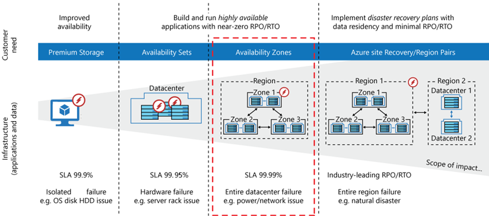
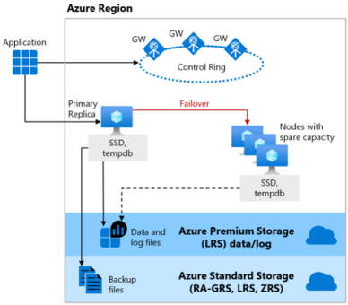
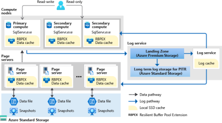
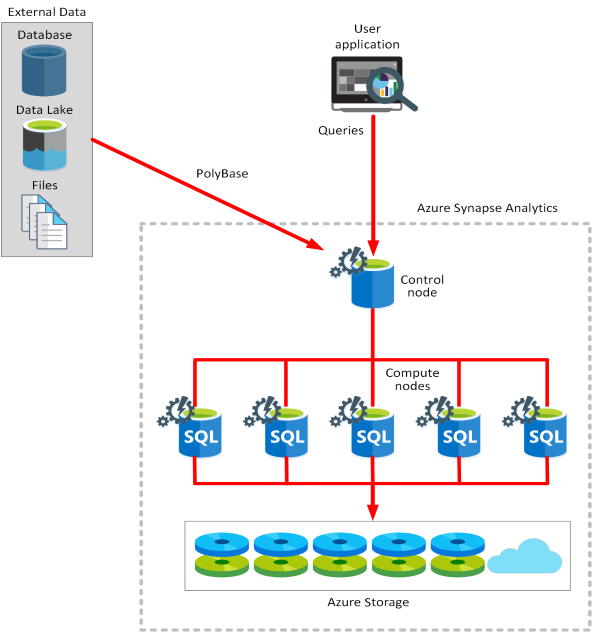
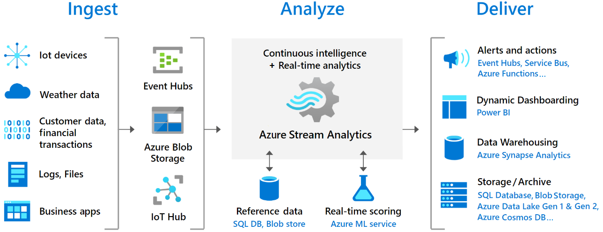

# MS-Learn notes AZ-305

## Index
- [MS-Learn notes AZ-305](#ms-learn-notes-az-305)
  - [Index](#index)
  - [Governance](#governance)
    - [Management Groups](#management-groups)
    - [Subscriptions](#subscriptions)
    - [Resource Groups](#resource-groups)
    - [Resource Tags](#resource-tags)
      - [Table with Resource tag examples](#table-with-resource-tag-examples)
    - [Azure Policy](#azure-policy)
    - [Role-Based Access Control (RBAC)](#role-based-access-control-rbac)
    - [Landing Zones](#landing-zones)
    - [Links related to Architecting, Governance and Landing Zones](#links-related-to-architecting-governance-and-landing-zones)
  - [Authentication and authorization](#authentication-and-authorization)
    - [Azure AD B2B](#azure-ad-b2b)
    - [Azure AD B2C](#azure-ad-b2c)
      - [Comparison between B2B to B2C](#comparison-between-b2b-to-b2c)
    - [Conditional Access](#conditional-access)
    - [Managed Identities](#managed-identities)
    - [Service principals for applications](#service-principals-for-applications)
    - [Key Vault](#key-vault)
  - [Monitor](#monitor)
    - [Overview of Azure Monitor](#overview-of-azure-monitor)
    - [Characteristics of Azure Monitor](#characteristics-of-azure-monitor)
    - [Billing](#billing)
    - [Things to consider when using Azure Monitor Logs workspaces](#things-to-consider-when-using-azure-monitor-logs-workspaces)
    - [Recommendations](#recommendations)
    - [Azure Workbooks](#azure-workbooks)
    - [Azure Data Explorer](#azure-data-explorer)
  - [Networking](#networking)
    - [Virtual Network (vNET)](#virtual-network-vnet)
      - [Address space](#address-space)
  - [Design business continuity](#design-business-continuity)
    - [SLA uptime level table](#sla-uptime-level-table)
    - [Availability metrics](#availability-metrics)
    - [Azure Front Door](#azure-front-door)
      - [High availability solutions for Azure Front Door](#high-availability-solutions-for-azure-front-door)
    - [Azure Traffic Manager](#azure-traffic-manager)
      - [High availability scenarios for Azure Traffic Manager](#high-availability-scenarios-for-azure-traffic-manager)
      - [Example of Active/Passive scenario with Traffic Manager](#example-of-activepassive-scenario-with-traffic-manager)
    - [High Availability for Compute](#high-availability-for-compute)
      - [Availability zones](#availability-zones)
      - [VM HA options](#vm-ha-options)
      - [Zonal architucture](#zonal-architucture)
      - [Zone-redundant architecture](#zone-redundant-architecture)
    - [Virtual Machine Scale set options](#virtual-machine-scale-set-options)
    - [Highly Available Container solution](#highly-available-container-solution)
      - [Describe Azure Storage replication options for AKS](#describe-azure-storage-replication-options-for-aks)
      - [Consider Azure Backup or Velero for AKS data](#consider-azure-backup-or-velero-for-aks-data)
    - [HA for relational data](#ha-for-relational-data)
      - [Azure SQL](#azure-sql)
        - [General Purpose](#general-purpose)
        - [Business Critical](#business-critical)
        - [Hyperscale](#hyperscale)
      - [Azure SQL SLA](#azure-sql-sla)
      - [Active geo-replication for SQL](#active-geo-replication-for-sql)
      - [Compare geo-replication to failover groups](#compare-geo-replication-to-failover-groups)
    - [Storage Redundancy](#storage-redundancy)
      - [Redundancy options](#redundancy-options)
        - [Summary of storage redundancy options](#summary-of-storage-redundancy-options)
    - [Useful links](#useful-links)
  - [Design business continuity solutions](#design-business-continuity-solutions)
    - [Design for backup and recovery](#design-for-backup-and-recovery)
      - [What can you do with Azure Backup?](#what-can-you-do-with-azure-backup)
      - [Where is the data backed up?](#where-is-the-data-backed-up)
    - [Design for Azure blob backup and recovery](#design-for-azure-blob-backup-and-recovery)
      - [Blob soft delete and versioning](#blob-soft-delete-and-versioning)
    - [Design for Azure files backup and recovery](#design-for-azure-files-backup-and-recovery)
      - [Azure files backup details](#azure-files-backup-details)
      - [Considerations for file share backups](#considerations-for-file-share-backups)
    - [Design for Azure virtual machine backup and recovery](#design-for-azure-virtual-machine-backup-and-recovery)
      - [Considerations for virtual machine backups and restore](#considerations-for-virtual-machine-backups-and-restore)
    - [Design Azure SQL backup and recovery](#design-azure-sql-backup-and-recovery)
      - [SQL Automated backup overview](#sql-automated-backup-overview)
      - [SQL backup use cases](#sql-backup-use-cases)
      - [Long-term backup retention policies](#long-term-backup-retention-policies)
    - [Design for Azure Site Recovery](#design-for-azure-site-recovery)
      - [What can you do with Azure Site Recovery?](#what-can-you-do-with-azure-site-recovery)
  - [Design data storage solutions](#design-data-storage-solutions)
    - [Storage account types](#storage-account-types)
    - [Azure Blob storage](#azure-blob-storage)
    - [Azure Blob immutable storage](#azure-blob-immutable-storage)
    - [Azure Files](#azure-files)
      - [Performance level](#performance-level)
    - [Comparison chart between Azure Blob, Azure Files and Azure NetApp Files](#comparison-chart-between-azure-blob-azure-files-and-azure-netapp-files)
    - [Managed Disks](#managed-disks)
    - [Design for Storage Security](#design-for-storage-security)
      - [Security Options that can be used](#security-options-that-can-be-used)
      - [Service endpoints](#service-endpoints)
      - [Private endpoints](#private-endpoints)
  - [Design a data storage solution for relational data](#design-a-data-storage-solution-for-relational-data)
    - [Things to know about Azure SQL database](#things-to-know-about-azure-sql-database)
    - [Pricing options](#pricing-options)
    - [SQL Managed Instance](#sql-managed-instance)
    - [Compare Azure SQL deployment options](#compare-azure-sql-deployment-options)
    - [Azure SQL Purchasing models and service tiers](#azure-sql-purchasing-models-and-service-tiers)
    - [Things to know about horizontal scaling](#things-to-know-about-horizontal-scaling)
    - [Scaling scenarios](#scaling-scenarios)
    - [Database availability solutions](#database-availability-solutions)
      - [Examples of different tiers and availability](#examples-of-different-tiers-and-availability)
        - [Tiers and availability comparison](#tiers-and-availability-comparison)
    - [Azure SQL Data encryption](#azure-sql-data-encryption)
    - [Azure SQL Edge](#azure-sql-edge)
      - [Things to know about Azure SQL Edge](#things-to-know-about-azure-sql-edge)
  - [Design data integration](#design-data-integration)
    - [Azure Data Factory](#azure-data-factory)
    - [Things to know about Azure Data Factory](#things-to-know-about-azure-data-factory)
    - [Azure Data Lake](#azure-data-lake)
      - [Things to know about Azure Data Lake](#things-to-know-about-azure-data-lake)
      - [How Azure Data Lake Storage works](#how-azure-data-lake-storage-works)
      - [Compare Azure Data Lake with Azure Blob Storage](#compare-azure-data-lake-with-azure-blob-storage)
    - [Azure Databricks](#azure-databricks)
      - [Things to consider when using Azure Databricks](#things-to-consider-when-using-azure-databricks)
    - [Azure Synapse Analytics](#azure-synapse-analytics)
      - [Things to know about Azure Synapse Analytics](#things-to-know-about-azure-synapse-analytics)
    - [Azure Stream Analytics](#azure-stream-analytics)
      - [Things to know about Azure Stream Analytics](#things-to-know-about-azure-stream-analytics)
  - [To try after the exam](#to-try-after-the-exam)

## Governance

### Management Groups

- A management group tree can support up to six levels of depth. This limit doesn't include the tenant root level or the subscription level.
- **Design management groups with governance in mind.** Use Azure policies at the management group level for all workloads that require the same security, compliance, connectivity, and feature settings.
- **Consider a top-level management group.** Implement a top-level management group to support common platform policy and Azure role assignments across the entire organization. A Tailwind Traders management group can be a top-level management group for all organizational-wide policies

### Subscriptions

- **Treat subscriptions as a democratized unit of management.** Align your subscriptions to meet specific company business needs and priorities.
- **Group subscriptions together under management groups.** Group together subscriptions that have the same set of policies and Azure role assignments to inherit these settings from the same management group.
- **Consider a dedicated shared services subscription.** Use a shared services subscription to ensure all common network resources are billed together and isolated from other workloads. Examples of shared services subscriptions include Azure ExpressRoute and Virtual WAN.
- **Consider subscription scale limits.** Subscriptions serve as a scale unit for component workloads. Large, specialized workloads like high-performance computing, IoT, and SAP are all better suited to use separate subscriptions. By having separate subscriptions for different Tailwind Traders groups or tasks, you can avoid resource limits (such as a limit of 50 Azure Data Factory integrations).
- **Consider administrative management.** Subscriptions provide a management boundary, which allows for a clear separation of concerns. Will each subscription for your company need a separate administrator, or can you combine subscriptions?
- **Consider how to assign Azure policies.** Both management groups and subscriptions serve as a boundary for the assignment of Azure policies
- **Consider network topologies.** Virtual networks can't be shared across subscriptions. Resources can connect across subscriptions with different technologies, such as virtual network peering or Virtual Private Networks (VPNs).

### Resource Groups

- Resources in the resource group can be in different regions.
- Resource groups can't be nested.
- Each resource must be in one, and only one, resource group.
- Resource groups can't be renamed.
- **Consider resource life cycle.** Design your resource groups according to life cycle requirements. Do you want to deploy, update, and delete certain resources at the same time? If so, place these resources in the same resource group.

### Resource Tags

Consider the type of tagging required. Plan to use different types of resource tags to support the Tailwind Traders organization. Resource tags generally fall into five categories: 

1. functional
2. classification
3. accounting
4. partnership
5. purpose.

#### Table with Resource tag examples

| Tag type       | Description                                                                                                                                                                                | Example name-value pairs                                                                  |
|----------------|--------------------------------------------------------------------------------------------------------------------------------------------------------------------------------------------|-------------------------------------------------------------------------------------------|
| Functional     | Functional tags categorize resources according to their purpose within a workload. This tag shows the deployed environment for a resource, or other functionality and operational details. | - app = catalogsearch1 - tier = web - webserver = apache - env = production, dev, staging |
| Classification | Classification tags identify a resource by how it's used and what policies apply to it.                                                                                                    | - confidentiality = private - SLA = 24hours                                               |
| Accounting     | Accounting tags allow a resource to be associated with specific groups within an organization for billing purposes.                                                                        | - department = finance - program = business-initiative - region = northamerica            |
| Partnership    | Partnership tags provide information about the people (other than IT members) who are associated with a resource, or otherwise affected by the resource.                                   | - owner = jsmith - contactalias = catsearchowners - stakeholders = user1;user2;user3      |
| Purpose        | Purpose tags align resources to business functions to better support investment decisions.                                                                                                 | - businessprocess = support - businessimpact = moderate - revenueimpact = high            |

### Azure Policy

The following events or times trigger an evaluation:

- A resource is created, deleted, or updated in scope with a policy assignment.
- A policy or an initiative is newly assigned to a scope.
- An assigned policy or initiative for a scope is updated.
- The standard compliance evaluation cycle (occurs once every 24 hours).

### Role-Based Access Control (RBAC)

A user's identity goes through several phases:

1. Initially, the user has no access. 
2. Access can be granted through RBAC and verified with Azure AD conditional access. 
3. Azure AD Identity Protection can be used to monitor the user's access. 
4. Periodically, Azure AD access reviews confirm the access is still required.

Things to consider when using Azure RBAC

- Consider the highest scope level for each requirement
- Consider the access needs for each user.
- Consider assigning roles to groups, and not users.
- Consider when to use Azure policies
  - By using a combination of Azure policies and Azure RBAC, you can provide effective access control

### Landing Zones

Things to know about Azure landing zones

- Landing zones are defined by management groups and subscriptions that are designed to scale according to business needs and priorities.
- Azure policies are associated with landing zones to ensure continued compliance with the organization platform.
- Landing zones are pre-provisioned through code.
- A landing zone can be scoped to support application migrations and development to scale across the organization's full IT portfolio.
- The Azure landing zone accelerator can be deployed into the same Azure AD tenant for an existing Azure architecture. The accelerator is an Azure-portal-based deployment.

Landing zone example:

### Links related to Architecting, Governance and Landing Zones

- [Resource naming and tagging decision guide](https://learn.microsoft.com/en-us/azure/cloud-adoption-framework/decision-guides/resource-tagging/?toc=%2Fazure%2Fazure-resource-manager%2Fmanagement%2Ftoc.json)
- [Define your naming convention](https://learn.microsoft.com/en-us/azure/cloud-adoption-framework/ready/azure-best-practices/resource-naming)
- [Abbreviation examples for Azure resources](https://learn.microsoft.com/en-us/azure/cloud-adoption-framework/ready/azure-best-practices/resource-abbreviations)
- [Azure Naming Tool](https://github.com/microsoft/CloudAdoptionFramework/tree/master/ready/AzNamingTool)
- [Azure Blueprints documentation](https://learn.microsoft.com/en-us/azure/governance/blueprints/)
- [Recommended policies for Azure services](https://learn.microsoft.com/en-us/azure/governance/policy/concepts/recommended-policies)
- [Landing zone implementation options](https://learn.microsoft.com/en-us/azure/cloud-adoption-framework/ready/landing-zone/implementation-options)
- [Azure landing zone accelerator](https://learn.microsoft.com/en-us/azure/cloud-adoption-framework/ready/landing-zone/#azure-landing-zone-accelerator)

## Authentication and authorization

### Azure AD B2B

- Consider designating an app owner to manage guest users
- Consider conditional access policies to control access
- Consider the benefits of using MFA

### Azure AD B2C

Azure AD B2C is a type of Azure AD tenant for managing customer identities and their access to your apps. Azure AD B2C requires an Azure AD tenant, but this tenant isn't the same as the Azure AD tenant for your organization.

- The Azure AD tenant represents your organization.
- The Azure AD B2C tenant represents the identities for your customer apps

#### Comparison between B2B to B2C

|                                           | **Azure AD B2B (business-to-business)**                                                                                                                                                                                                         | **Azure AD B2C (business-to-customer)**                                                                                                                                                                                                          |
|-------------------------------------------|-------------------------------------------------------------------------------------------------------------------------------------------------------------------------------------------------------------------------------------------------|--------------------------------------------------------------------------------------------------------------------------------------------------------------------------------------------------------------------------------------------------|
| Define your focus                         | Tailwind Traders wants to collaborate with business partners from external organizations like suppliers, partners, and vendors. You'll support users as guest users in your directory, and they might or might not have managed IT.             | Tailwind Traders wants to engage with customers of their products. You'll manage users in a separate Azure AD directory / tenant.                                                                                                                |
| Identify your users                       | Your users will represent a Tailwind Traders partner company, or be employees of Tailwind Traders.                                                                                                                                              | Your users will be customers of Tailwind Traders who represent themselves.                                                                                                                                                                       |
| Manage user profiles                      | Tailwind Traders will manage partner user profiles through access reviews, email verification, or access and blocklists.                                                                                                                        | Customer users of Tailwind Traders will manage their own profiles.                                                                                                                                                                               |
| Store user information                    | You'll manage external users in the same directory as Tailwind Traders employees, but the external users will typically be annotated as guest users. Guest users can be managed the same way as employees, added to the same groups, and so on. | You'll manage external users in the Azure AD B2C directory. They're managed separately from the Tailwind Traders employee and partner directory (if any).                                                                                        |
| Enable user discovery and support privacy | Partner users of Tailwind Traders will be discoverable and they can find other users from their organization.                                                                                                                                   | Customer users of Tailwind Traders will be invisible to other users. Privacy and content will be enforced.                                                                                                                                       |
| Work with identity providers              | External users will collaborate by using work accounts, school accounts, any email address, SAML and WS-Fed based identity providers, Gmail, and Facebook.                                                                                      | Consumer users with local app accounts (any email address or user name), various supported social identities, and users with corporate and government-issued identities via SAML/WS-Fed based identity provider federation will access the apps. |
| Customize UI and support branding         | You expect to use customized UI branding for the host or inviting organization (Tailwind Traders).                                                                                                                                              | You want the branding to be fully customizable per app or organization and not specific to Tailwind Traders.                                                                                                                                     |

### Conditional Access

- Consider MFA for more granular control
- Consider preventing access from specific geographic areas
- Consider access only from managed devices
- Consider access only from approved client apps
- Consider using policies to handle compromised accounts
  - Require all users to register for MFA
  - Require a password change for users who are high-risk
  - Require MFA for users with medium or high sign-in risk
- Consider blocking access
- Consider blocking legacy authentication protocols
- Consider running Report-only mode
- Consider using the What If tool

### Managed Identities

- When you use managed identities, you don't need to rotate credentials or worry about expiring certifications. Azure handles credential rotation and expiration in the background. To configure an app to use a managed identity, you use the provided token to call the service.
- There are two types of managed identities
  - System-assigned - tied to the lifecycle of the azure resource that created it. Can be used only for that Azure resource
  - User-assigned - created as a standalone Azure resource. Can be used by multiple resources and is managed seperately.

### Service principals for applications

There are two ways an app can be represented in Azure AD:

- **Application object** - An app object allows the service to know how to issue tokens to the app based on the object settings. The app object exists only in its home directory, even if it's a multi-tenant app that supports service principals in other directories
- **Service Principal** - The service principal for an app can be considered an instance of an app. Service principals generally reference an app object. One app object can be referenced by multiple service principals across directories

There are three types of service principals:

1. **Application** 
2. **Managed Identity** Managed identities provide an identity for applications to use when connecting to resources that support Azure AD authentication. When a managed identity is enabled, the service principal that represents that managed identity is created in your tenant
3. **Legacy** A legacy service principal represents a legacy app that was created before app registrations were introduced, or an app created through a legacy configuration experience. A legacy service principal can have credentials, service principal names, reply URLs, and other properties that an authorized user can edit. A legacy service principal doesn't have an associated app registration.

Characteristics of app objects and service principals

- An app can have at most one app object, which is registered in a "home" directory.
- An app can have one or more service principal objects that represent instances of the app in every directory in which it acts.
- An app object has a `1:1` relationship with the software app, and a `1:many` relationship with its service principal object(s).
- A service principal must be created in each tenant where the app is used, to establish an identity for sign-in and access to resources secured by the tenant.
- A single-tenant app has only one service principal (in its home tenant) that's created and consented for use during app registration. A multi-tenant app also has a service principal created in each tenant where a user from that tenant has consented to its use.
- Managed identity service principals can be granted access and permissions, but they can't be updated or modified directly.
- Legacy service principals can only be used in the tenant where they're created.

Things to consider

- **Consider how to create your application service principals.** A service principal object for an app can be created in different ways:
  - When an app is given permission to access resources in a tenant (upon registration or consent), a service principal object is created.
  - When you register an app by using the Azure portal, a service principal is created automatically.
  - You can create service principal objects in a tenant by using Azure PowerShell, the Azure CLI, Microsoft Graph, and other tools.
- **Consider service principals without managed identities.** Use service principals without managed identities when you want to be able to manage the credentials.
- **Consider authentication of external apps to Azure resources.** Authenticate external apps to Azure resources by using service principals.
- **Consider the best practices for requesting permissions.** (Recommended) Review these suggestions for how to build apps that use Azure AD to provide sign-in and access tokens for secured endpoints:
  - Only ask for the permissions required for implemented app functionality. Don't request user consent for permissions that you haven't yet implemented for your application.
  - When you request permissions for app functionality, request the least-privileged access. If an app analyzes a user's email, but it takes no action on the mailbox, you shouldn't request the more permissive Mail.ReadWrite permission when the Mail.Read permission is sufficient.
  - Apps should gracefully handle scenarios where the user doesn't grant consent to the app when permissions are requested. In the case where an app doesn't receive an access token with the required permissions, the app should explain the situation to the user with options on how to remedy the issue.
- **Consider restricting user consent.** (Microsoft recommended) Restrict user consent to allow users to consent only for apps from verified publishers, and only for the Tailwind Traders permissions you select. For apps that don't meet this policy, centralize the decision-making process to the security and identity administrator team. After end-user consent is disabled or restricted, there are several important considerations to ensure your organization stays secure while still allowing business-critical applications to be used. These steps are crucial to minimize impact on your organization's support team and IT admins, while preventing the use of unmanaged accounts in third-party applications.

### Key Vault

- Key Vault is available in two service tiers:
  - Standard tier lets you encrypt your data with a software key.
  - Premium tier offers hardware security module (HSM)-protected keys.

Things to consider with key vault:

- Consider shared access signatures for clients. Implement shared access signatures to provide secure delegated access to resources in your Tailwind Traders storage account. With Key Vault shared access signatures, you have granular control over how clients can access your data:
  - Determine which resources the client can access. 
  - Define the client's permissions for those resources.
  - Specify how long the client's shared access signature is valid.

## Monitor

- **Azure Monitor Logs** lets you collect and organize data from resources that you monitor. You configure what data is gathered and how it's organized in the platform. Other features in Azure Monitor automatically store their data in Logs. You can use the stored data with your collected data to help monitor the performance of your environment.
- **Azure Monitor Metrics** captures numerical data from your monitored resources and stores the results in a time-organized database. Metrics are collected at intervals you specify. You can use metrics to check how your system is performing at a particular time or under certain circumstances.

### Overview of Azure Monitor

### Characteristics of Azure Monitor

- Data from multiple resources can be collected into Azure Monitor and analyzed together by using a common set of tools.
- Logs enable complex analysis by using log queries.
- Metrics support near-real-time scenarios like priority alerts and responding to critical issues.
- Monitoring data can be sent to other locations to support certain scenarios, such as tracking and reporting.
- Sources of monitoring data from Azure applications can be organized into tiers, and each tier can be accessed in different ways.
  - The highest tiers are for your application itself.
  - The lower tiers are components of the Azure platform.

Services that require an agent

- Azure Cloud Services
- Azure Virtual Machines
- Azure Virtual Machine Scale Sets
- Azure Service Fabric

### Billing

Excluded columns

- _ResourceId
- _SubscriptionId
- _ItemId
- _IsBillable
- _BilledSize
- Type

Excluded tables

-  AzureActivity
-  Heartbeat
-  Usage
-  Operation

### Things to consider when using Azure Monitor Logs workspaces

- **Consider your access control strategy.** As you plan for how many workspaces to use in the Tailwind Traders organization, consider these potential requirements:
  - Is your organization a global company? Do you need log data stored in specific regions for data sovereignty or compliance reasons?
  - Does your architecture use Azure? Do you want to avoid outbound data transfer charges by having a workspace in the same region as the Azure resources it manages?
  - Does the system support multiple departments or business groups? Each group should access their data and not the data of others. Also, there's no business requirement for a consolidated cross department or business group view.
- **Consider deployment model options.** Most IT organizations use a centralized, decentralized, or hybrid model for their architecture. Consider these common workspace deployment models, and how they might work for the Tailwind Traders organization:

| **Deployment** | **Description**                                                                                                                                                                                                                                                                                                                                                                                                                                                                          |
|----------------|------------------------------------------------------------------------------------------------------------------------------------------------------------------------------------------------------------------------------------------------------------------------------------------------------------------------------------------------------------------------------------------------------------------------------------------------------------------------------------------|
| Centralized    | All logs are stored in a central workspace and administered by a single team. Azure Monitor provides differentiated access per-team. In this scenario, it's easy to manage, search across resources, and cross-correlate logs. The workspace can grow significantly depending on the amount of data collected from multiple resources in your subscription. Extra administrative overhead is needed to maintain access control to different users. This model is known as hub and spoke. |
| Decentralized  | Each team has their own workspace created in a resource group they own and manage. Log data is segregated per resource. In this scenario, the workspace can be kept secure and access control is consistent with resource access. A disadvantage of this module is that it can be difficult to cross-correlate logs. Users who need a broad view of many resources can't analyze the data in a meaningful way.                                                                           |
| Hybrid         | A hybrid approach can be complicated by security audit compliance requirements. Many organizations implement both deployment models in parallel. The hybrid design commonly results in a complex, expensive, and hard-to-maintain configuration with gaps in logs coverage.                                                                                                                                                                                                              |
- **Consider access mode.** Plan for how your users can access Azure Monitor Logs workspaces and define the scope of data they can access. Tailwind Traders users have two options for accessing their data:

| **Access mode**   | **Description**                                                                                                                                                                                                                                                                                                                                  |
|-------------------|--------------------------------------------------------------------------------------------------------------------------------------------------------------------------------------------------------------------------------------------------------------------------------------------------------------------------------------------------|
| Workspace-context | A user can review all logs in the workspace for which they have permission. Queries are scoped to all data in all tables in the workspace. Logs are accessed with the workspace as the scope by selecting Logs from the Azure Monitor menu in the Azure portal.                                                                                  |
| Resource-context  | A user accesses the workspace for a particular resource, resource group, or subscription. By selecting Logs from a resource menu in the Azure portal, they can view logs for only resources in all tables for which they have access. Queries are scoped to only data associated with that resource. This mode also enables granular Azure RBAC. |                                                                                                                                                                                                            |

- **Consider scale and ingestion volume rate limit.** Azure Monitor is a high scale data service that serves thousands of customers sending petabytes of data each month at a growing pace. Workspaces aren't limited in their storage space and can grow to petabytes of data. There's no need to split workspaces due to scale.

### Recommendations

This scenario shows a recommended design for a single workspace in your IT organization's subscription.

### Azure Workbooks

Workbooks have the ability to combine data from disparate sources within a single report. You can create composite resource views or joins across resources enabling richer data and insights that would otherwise be impossible.

- Azure Workbooks lets you tap into multiple data sources from across Azure and combine them into unified interactive experiences.
- Authors of workbooks can transform ingested data to provide insights into the availability, performance, usage, and overall health of the underlying components.
- You can analyze performance logs from virtual machines to identify high CPU or low memory instances and display the results as a grid in an interactive report.
- Workbooks are currently compatible with the following data sources:
  - Logs
  - Metrics
  - Azure Resource Graph
  - Alerts
  - Workload Health
  - Azure Resource Health
  - Azure Data Explorer

### Azure Data Explorer

Things to know about Azure Data Explorer

- Azure Data Explorer is a fast and highly scalable data exploration service for log and telemetry data.
- Azure Data Explorer helps you handle multiple data streams, so you can collect, store, and analyze your data from all resources.
- Analyze large volumes of diverse data from any data source, such as websites, applications, IoT devices, and more.
- Use Azure Data Explorer for diagnostics, monitoring, reporting, machine learning, and other analytics tasks.

Microsoft Sentinel and Azure Monitor SaaS solutions don't offer out-of-the-box support for certain scenarios like application trace logs. You can use Azure Data Explorer to provide monitoring support for all aspects and for more types of logs.

Azure Data Explorer provides greater flexibility for building quick and easy near-real-time analytics dashboards, pattern recognition, and time series analysis. The tool supports granular role-based access control, anomaly detection and forecasting, and machine learning.

Below is an image of a monitoring solution that utilizes Data Explorer

## Networking

### Virtual Network (vNET)

#### Address space

The address space needs to be unique within your subscription and any other networks that you connect to

## Design business continuity

### SLA uptime level table

| **SLA** | **Downtime per week** | **Downtime per month** | **Downtime per year** |
|---------|-----------------------|------------------------|-----------------------|
| 99%     | 1.68 hours            | 7.2 hours              | 3.65 days             |
| 99.9%   | 10.1 minutes          | 43.2 minutes           | 8.76 hours            |
| 99.95%  | 5 minutes             | 21.6 minutes           | 4.38 hours            |
| 99.99%  | 1.01 minutes          | 4.32 minutes           | 52.56 minutes         |
| 99.999% | 6 seconds             | 25.9 seconds           | 5.26 minutes          |

### Availability metrics

Use these measures to plan for redundancy and determine customer SLAs.

- **Mean time to recover (MTTR)** is the average time it takes to restore a component after a failure.
- **Mean time between failures (MTBF)** is how long a component can reasonably expect to last between outages.

### Azure Front Door

[Azure Front Door](https://learn.microsoft.com/en-us/azure/frontdoor/front-door-overview) offers a fast, reliable, and secure modern cloud Content Delivery Network (CDN) by using the Microsoft global edge network to integrate with intelligent threat protection. Azure Front Door optimizes access times to content. Front Door can be used to provide another layer of reliability in front of your Azure resources. It is an application delivery network that provides global load balancing and site acceleration service for web applications. It offers Layer 7 capabilities for your application like SSL offload, path-based routing, fast failover, caching, etc. to improve performance and high-availability of your applications.

#### High availability solutions for Azure Front Door

| **Approach**                     | **Description**                                                                                                                                                                                                                                                   |
|----------------------------------|-------------------------------------------------------------------------------------------------------------------------------------------------------------------------------------------------------------------------------------------------------------------|
| Active/passive with hot standby  | Traffic goes to one region, while the other waits on hot standby. Hot standby means the VMs in the secondary region are always running.                                                                                                                           |
| Active/passive with cold standby | Traffic goes to one region, while the other waits on cold standby. Cold standby means the VMs in the secondary region aren’t allocated until needed for failover. This approach costs less to run but will generally take longer to come online during a failure. |
| Active/active                    | Both regions are active, and requests are load balanced between them. If one region becomes unavailable, it’s taken out of rotation.                                                                                                                              |

### Azure Traffic Manager

[Azure Traffic Manager](https://learn.microsoft.com/en-us/azure/traffic-manager/traffic-manager-overview) is a DNS-based traffic load balancer. This service allows you to distribute traffic to your public facing applications across the global Azure regions. Traffic Manager also provides your public endpoints with high availability and quick responsiveness. It is a DNS-based traffic load balancer that enables you to distribute traffic optimally to services across global Azure regions, while providing high availability and responsiveness. Because Traffic Manager is a DNS-based load-balancing service, it load balances only at the domain level. For that reason, it can't fail over as quickly as Front Door, because of common challenges around DNS caching and systems not honoring DNS TTLs.

#### High availability scenarios for Azure Traffic Manager

| **Approach**                     | **Description**                                                                                                                                                                                                                                                                                                                                              |
|----------------------------------|--------------------------------------------------------------------------------------------------------------------------------------------------------------------------------------------------------------------------------------------------------------------------------------------------------------------------------------------------------------|
| Active/Passive with cold standby | Your VMs (and other appliances) that are running in the standby region aren't active until needed. However, your production environment is replicated to a different region. This approach is cost-effective but takes longer to undertake a complete failover.                                                                                              |
| Active/Passive with pilot light  | You establish the standby environment with a minimal configuration; it has only the necessary services running to support a minimal and critical set of apps. In its default form, this approach can only execute minimal functionality. However, it can scale up and spawn more services, as needed, to take more of the production load during a failover. |
| Active/Passive with warm standby | Your standby region is pre-warmed and is ready to take the base load. Auto scaling is on, and all the instances are up and running. This approach isn't scaled to take the full production load but is functional, and all services are up and running.                                                                                                      |

#### Example of Active/Passive scenario with Traffic Manager

)

### High Availability for Compute

#### Availability zones

#### VM HA options

#### Zonal architucture

#### Zone-redundant architecture

### Virtual Machine Scale set options

| **Scenario**                                        | **Group of virtual machines**                                                          | Virtual machine scale sets                                                             |
|-----------------------------------------------------|----------------------------------------------------------------------------------------|----------------------------------------------------------------------------------------|
| You need to add VM instances for changing workload  | Manual process to create, configure, and ensure compliance                             | Automatically create from central configuration                                        |
| You need to balance and distribute workloads        | Manual process to create and configure Azure load balancer or Application Gateway      | Can automatically create and integrate with Azure load balancer or Application Gateway |
| You need high availability and redundancy           | Manually create Availability Set or distribute and track VMs across Availability Zones | Automatic distribution of VM instances across Availability Zones or Availability Sets  |
| You need to monitor and then scale virtual machines | Manual monitoring and Azure Automation                                                 | Autoscale based on host metrics, in-guest metrics, Application Insights, or schedule   |

### Highly Available Container solution

When planning to implement AKS clusters across multiple region deployments, consider the following:

- **AKS region availability.** Choose regions that are close to your users. Keep in mind that AKS is continually expanding into new regions.
- **Azure paired regions.** For your geographic area, choose two regions paired together. Also consider that:
  - AKS platform updates (planned maintenance) are serialized with a delay of at least 24 hours between paired regions.
  - Recovery efforts for paired regions are prioritized where needed.
- **Service availability.** Decide whether your paired regions should be hot/hot, hot/warm, or hot/cold. In other words, do you want to run both regions at the same time, with one region ready to start serving traffic? Or do you want to give one region time to get ready to serve traffic?

#### Describe Azure Storage replication options for AKS

It's probable that your apps use Azure Storage for their data. Assuming they do, and that those apps are distributed across multiple AKS clusters in multiple regions, you'll need a way to synchronize storage. With Azure Storage, there are two possible options you can consider:

- Infrastructure-based asynchronous replication
- Application-based asynchronous replication

#### Consider Azure Backup or Velero for AKS data

As with any app, it's important you back up the data related to your AKS clusters and their apps. When your apps consume and store data which is persisted on disks or in files, you should schedule frequent backups or take regular snapshots of that data. You can use several tools for these backup operations, including:

- **Azure Disks:** Azure Disks can use built-in snapshot technologies. However, your apps might need to flush writes-to-disk before the snapshot operation.
- **Velero:** Velero can back up persistent volumes along with additional cluster resources and configurations.

### HA for relational data

#### Azure SQL

Two purchasing models

- DTU
- vCore

Service Tiers:

##### General Purpose

##### Business Critical

Using Business Critical is like deploying an Always On availability group (AG) behind the scenes. Unlike in the General Purpose tier, in Business Critical, the data and log files are all running on direct-attached SSD, which significantly reduces network latency. (General Purpose uses remote storage.) In this AG, there are three secondary replicas. One of them can be used as a read-only endpoint (at no additional charge). A transaction can complete a commit when at least one of the secondary replicas has hardened the change for its transaction log.

##### Hyperscale

Business Critical maintains the highest performance and availability for workloads with small log writes that need low latency. But the Hyperscale service tier allows you to get a higher log throughput in terms of MB/second, provides for the largest database sizes, and provides up to four secondary replicas for higher levels of read scale. So, you'll need to consider your workload when you choose between the two.

#### Azure SQL SLA

Currently, you can achieve the highest availability (99.995%) from an Azure SQL Database Business Critical deployment that has Availability Zones configured. The Business Critical tier is the only option in the industry that provides recovery point objective (RPO) and recovery time objective (RTO) SLAs of 5 seconds and 30 seconds, respectively.

For General Purpose or single-zone Business Critical deployments of Azure SQL Database or Azure SQL Managed Instance, the SLA is 99.99%.

The Hyperscale tier's SLA depends on the number of replicas. Remember that you choose how many replicas you have in Hyperscale. If you don't have any, the failover behavior is more like that of General Purpose. If you have replicas, the failover behavior is more like that of Business Critical. Here are the SLAs, based on the number of replicas:

- 0 replicas: 99.5%
- 1 replica: 99.9%
- 2 or more replicas: 99.99%

#### Active geo-replication for SQL

Active geo-replication isn’t supported by Azure SQL Managed Instance

#### Compare geo-replication to failover groups

|                                                   | Geo-replication | Failover groups |
|---------------------------------------------------|-----------------|-----------------|
| Automatic failover                                | No              | Yes             |
| Fail over multiple databases simultaneously       | No              | Yes             |
| User must update connection string after failover | Yes             | No              |
| SQL Managed Instance support                      | No              | Yes             |
| Can be in same region as primary                  | Yes             | No              |
| Multiple replicas                                 | Yes             | No              |
| Supports read-scale                               | Yes             | Yes             |

### Storage Redundancy

#### Redundancy options

**Locally redundant storage (LRS).** Helps protect your data against drive or server rack failures in a data center. But if a disaster occurs within the data center, all replicas of your storage account that uses LRS might be lost. This option:

- Copies your data synchronously three times within a single physical location in the primary region.
- Is the least expensive replication option.
- Isn’t recommended for apps that require high availability or durability.

**Zone-redundant storage (ZRS).** Helps ensure that your data is still accessible for both read and write operations even if a zone becomes unavailable. This option:

- Copies your data synchronously across three Azure availability zones in the primary region.
- Recommended by Microsoft for apps requiring high availability in the primary region and replicating to a secondary region.

**Geo-redundant storage (GRS).**

- Copies your data synchronously three times within a single physical location in the primary region using LRS.
- Copies your data asynchronously to a single physical location in the secondary region.
- Copies your data synchronously three times within the secondary region using LRS.

**Geo-zone-redundant storage (GZRS).**

- Copies your data synchronously across three Azure availability zones in the primary region using ZRS.
- Copies your data asynchronously to a single physical location in the secondary region.
- Copies your data synchronously three times using LRS within the secondary region.

##### Summary of storage redundancy options

| **Outage scenario**                                                                        | **LRS** | **ZRS** | **GRS/RA-GRS**    | **GZRS/RA-GZRS**   |
|--------------------------------------------------------------------------------------------|---------|---------|-------------------|--------------------|
| A node within a data center becomes unavailable                                            | Yes     | Yes     | Yes               | Yes                |
| An entire data center (zonal or non-zonal) becomes unavailable                             | No      | Yes     | Yes*              | Yes                |
| A region-wide outage occurs in the primary region                                          | No      | No      | Yes*              | Yes*               |
| Read access to the secondary region is available if the primary region becomes unavailable | No      | No      | Yes (with RA-GRS) | Yes (with RA-GZRS) |

### Useful links

- [Azure Service Level Agreements](https://azure.microsoft.com/en-us/support/legal/sla/)
- [Service Level Agreement Estimator](https://github.com/mspnp/samples/tree/main/Reliability/SLAEstimator)

## Design business continuity solutions

### Design for backup and recovery

Use the following table of considerations to provide guidance on this process.

| **Consideration**                               | **Description**                                                                                                                                                                                                                                                                                                                                                                                                                                                                                                                                                                                                  |
|-------------------------------------------------|------------------------------------------------------------------------------------------------------------------------------------------------------------------------------------------------------------------------------------------------------------------------------------------------------------------------------------------------------------------------------------------------------------------------------------------------------------------------------------------------------------------------------------------------------------------------------------------------------------------|
| What are your workloads and their usage?        | A workload is a distinct capability or task that is logically separated from other tasks, in terms of business logic and data storage requirements. Each workload probably has different requirements for availability, scalability, data consistency, and disaster recovery.                                                                                                                                                                                                                                                                                                                                    |
| What are the usage patterns for your workloads? | Usage patterns can determine your requirements. Identify differences in requirements during both critical and non-critical periods. To ensure uptime, plan redundancy across several regions in case one region fails. Conversely, to minimize costs during non-critical periods, you can run your application in a single region.                                                                                                                                                                                                                                                                               |
| What are the availability metrics?              | Mean time to recovery **(MTTR)** and mean time between failures **(MTBF)** are the typically used metrics. MTBF is how long a component can reasonably expect to last between outages. MTTR is the average time it takes to restore a component after a failure. Use these metrics to determine where you need to add redundancy, and to determine service-level agreements (SLAs) for customers.                                                                                                                                                                                                                        |
| What are the recovery metrics?                  | The recovery time objective **(RTO)** is the maximum acceptable time one of your apps can be unavailable following an incident. The recovery point objective **(RPO)** is the maximum duration of data loss that is acceptable during a disaster. Also consider the recovery level objective **(RLO)**. This metric determines the granularity of recovery. In other words, whether you must be able to recover a server farm, a web app, a site, or just a specific item. To determine these values, conduct a risk assessment. Ensure that you understand the cost and risk of downtime or data loss in your organization. |
| What are the workload availability targets?     | To help ensure that your app architecture meets your business requirements, define target SLAs for each workload. Account for the cost and complexity of meeting availability requirements, in addition to application dependencies.                                                                                                                                                                                                                                                                                                                                                                             |
| What are your SLAs?                             | In Azure, the SLA describes the Microsoft commitments for uptime and connectivity. If the SLA for a particular service is 99.9 percent, you should expect the service to be available 99.9 percent of the time.                                                                                                                                                                                                                                                                                                                                                                                                  |

#### What can you do with Azure Backup?

You can use Azure Backup for these backup types:

- **On-premises.** Azure Backup can back up files, folders, and system state using the Microsoft Azure Recovery Services (MARS) agent. Alternatively, you can use Data Protection Manager (DPM) or the Microsoft Azure Backup Server (MABS) agent to protect on-premises VMs (both Hyper-V and VMware), and other on-premises workloads.
- **Azure VM.** Back up entire Windows or Linux VMs (using backup extensions), or back up files, folders, and system state using the MARS agent.
- **Azure Files shares.** Back up Azure File shares to a storage account.
- **Microsoft SQL Server in Azure VMs.** Back up SQL Server databases running on Azure VMs.
- **SAP HANA databases in Azure VMs.** Back up SAP HANA databases running on Azure VMs.
- **Microsoft cloud.** Azure Backup can replace your existing on-premises or off-site backup solution with a cloud-based solution that's reliable, secure, and cost-competitive.

#### Where is the data backed up?

There are two types of vaults. The primary differences in the vaults are supported data sources and supported Azure products.

| **Capability**          | **Supported data sources**                                                                                                                      | **Supported products**            |
|-------------------------|-------------------------------------------------------------------------------------------------------------------------------------------------|-----------------------------------|
| Backup vault            | Azure database for PostgreSQL servers Azure blobs Azure disks                                                                                   | Azure Backup                      |
| Recovery services vault | Azure virtual machines (VMs) SQL in an Azure VM Azure Files SAP HANA in Azure VM Azure Backup Server Azure Backup Agent Data Protection Manager | Azure Backup, Azure Site Recovery |

### Design for Azure blob backup and recovery

#### Blob soft delete and versioning

- **Container soft delete** can restore a container and its contents at the time of deletion. The retention period for deleted containers is between 1 and 365 days. The default retention period is seven days.
- **Blob soft delete** can restore a blob, snapshot, or version that has been deleted. Blob soft delete is useful for restoring specific files. The retention period for deleted blobs is also between 1 and 365 days.
- **Blob versioning** works to automatically maintain previous versions of a blob. When blob versioning is enabled, you can restore an earlier version of a blob. Versioning lets you recover your data if it’s incorrectly modified or deleted. Blob versioning is useful if you have multiple authors editing files and need to maintain or restore their individual changes.

### Design for Azure files backup and recovery

#### Azure files backup details

- Share snapshots capture the share state at that point in time.
- Snapshots can be created manually using the Azure portal, REST API, client libraries, the Azure CLI, and PowerShell.
- Snapshots can be automated using Azure Backup and backup policies.
- Snapshots are at the root level of a file share and apply to all the folders and files contained in it. Retrieval is provided at individual file level.
- Snapshots are incremental. Only the deltas between your snapshots will be stored.
- After a share snapshot is created, it can be read, copied, or deleted, but not modified.
- You cannot delete a share that has share snapshots. To delete the share you must delete all the share snapshots.

> When Azure Backup is enabled on the file share soft delete is also enabled.

It is recommended you use Azure Backup to automate and manage file share snapshots.

[Automated file share backup](Images/file-share-automated.png)

#### Considerations for file share backups

- **Use instant restore.** Azure file share backup uses file share snapshots. You can select just the files you want to restore instantly.
- **Implement alerting and reporting.** You can configure alerts for backup and restore failures and use the reporting solution provided by Azure Backup. These reports provide insights on file share backups.
- **Consider self-service restore.** Backup uses server endpoint VSS snapshots. Consider giving advanced users the ability to restore files themselves.
- **Consider on-demand backups.** Azure Backup policies are limited to scheduling a backup once a day. If a user creates a file in the morning and works on it all day a nightly backup won’t have the new file. For these reasons consider on-demand backups for the most critical file shares.
- **Organize file shares for backup.** If possible, consider organizing your file shares for backups. For example, public facing vs internal file shares.
- **Snapshot before code deployments.** If a bug or application error is introduced with the new deployment, you can go back to a previous version of your data on that file share. To help protect against these scenarios, you can take a share snapshot before you deploy new application code.

### Design for Azure virtual machine backup and recovery

#### Considerations for virtual machine backups and restore

Here are some things to consider when planning your virtual machine backups.

- **Identify the best backup schedule.** To distribute backup traffic, consider backing up different VMs at different times of the day and make sure the times don't overlap. Ensure the backup scheduled start time is during non-peak production application times.
- **Determine backup frequency.** Implement both short-term (daily) and long-term (weekly) backups. If you need to take a backup not scheduled via backup policy, then you can use an on-demand backup. For example, backup on-demand multiple times per day when scheduled backup permits only one backup per day.
- **Create backup policies.** Consider grouping VMs that require the same schedule start time, frequency, and retention settings into a single backup policy. For example, create policies for critical and non-critical virtual machines.
- **Monitor and review your plan.** As your business requirements change, make sure to review and change your backup policies. Enable monitoring and alerting features and review the results.
- **Practice restoring from backup.** Restoring backups can be very time-consuming. The total restore time depends on the Input/output operations per second (IOPS) and the throughput of the storage account. The total restore time can be affected if the target storage account is loaded with other application read and write operations. To improve restore operation, select a storage account that isn't loaded with other application data.
- **Consider throttling.** If you're restoring VMs from a single vault, we highly recommend that you use different general-purpose v2 storage accounts to ensure that the target storage account doesn't get throttled. For example, each VM must have a different storage account. For example, if 10 VMs are restored, use 10 different storage accounts.
- **Consider Cross Region Restore (CRR).** CRR allows you to restore Azure VMs in a secondary region, which is an Azure paired region. This option lets you conduct drills to meet audit or compliance requirements. You can also restore the VM or its disk if there's a disaster in the primary region. CRR is an opt-in feature for any recovery services vault. CRR also works for SQL databases and SAP HANA databases hosted on Azure VMs.

### Design Azure SQL backup and recovery

#### SQL Automated backup overview

- **Full backups:** In a full backup, everything in the database and the transaction logs is backed up. SQL Database makes a full back up once a week.
- **Differential backups:** In a differential backup, everything that changed since the last full backup is backed up. SQL Database makes a differential backup every 12 - 24 hours.
- **Transactional backups:** In a transactional backup, the contents of the transaction logs are backed up. If the latest transaction log has failed or is corrupted, the option is to fall back to the previous transaction log backup. Transactional backups enable administrators to restore up to a specific time, which includes the moment before data was mistakenly deleted. Transaction log backups every five to 10 minutes.

#### SQL backup use cases

- **Restore an existing database** to a point in time in the past within the retention period. This operation creates a new database on the same server as the original database but uses a different name to avoid overwriting the original database. After the restore completes, you can delete the original database.
- **Restore a deleted database to the time of deletion** or to any point in time within the retention period. The deleted database can be restored only on the same server or managed instance where the original database was created.
- **Restore a database to another geographic region.** Geo-restore allows you to recover from a geographic disaster when you cannot access your database or backups in the primary region. It creates a new database on any existing server or managed instance, in any Azure region.
- **Restore a database from a specific long-term backup** of a single database or pooled database. If the database has been configured with a long-term retention policy you can restore an old version of the database.

#### Long-term backup retention policies

Azure SQL Database automatic backups remain available to restore for up to 35 days. This period is enough for the purposes of day-to-day administration. But sometimes you might need to retain data for longer periods. For example, data protection regulations in your local jurisdiction might require you to keep backups for several years.

For these requirements, use the long-term retention (LTR) feature. This way, you can store Azure SQL Database backups in read-access geo-redundant storage (RA-GRS) blobs for up to 10 years. If you need access to any backup in LTR, you can restore it as a new database by using either the Azure portal or PowerShell.

### Design for Azure Site Recovery

#### What can you do with Azure Site Recovery?

| **Feature**                        | **Details**                                                                                                                                                                                                                                                                                                            |
|------------------------------------|------------------------------------------------------------------------------------------------------------------------------------------------------------------------------------------------------------------------------------------------------------------------------------------------------------------------|
| Simple BCDR solution               | Use Site Recovery in the Azure portal to setup and manage replication, failover, and failback from a single location.                                                                                                                                                                                                  |
| Azure VM replication               | Setup disaster recovery of your Azure VMs, and failover from a primary region to a secondary region.                                                                                                                                                                                                                   |
| On-premises VM replication         | Replicate on-premises VMs and physical servers to Azure, or to a secondary on-premises datacenter.                                                                                                                                                                                                                     |
| Workload replication               | Replicate any workload running on supported Azure VMs, on-premises Hyper-V and VMware VMs, and Windows or Linux physical servers.                                                                                                                                                                                      |
| Data resilience                    | Orchestrate replication without intercepting app data by using Site Recovery. When failover occurs, Azure VMs are created, based on the replicated data. When you replicate to Azure, data is stored in Azure storage, with the resilience that provides.                                                              |
| RTO and RPO targets                | Keep RTO and RPO within defined organizational limits. Site Recovery provides continuous replication for Azure VMs and VMware VMs, and replication frequency as low as 30 seconds for Hyper-V.                                                                                                                         |
| Keep apps consistent over failover | By using app-consistent snapshots, you can replicate using recovery points. These snapshots capture disk data, data in memory, and all in process transactions.                                                                                                                                                        |
| Testing without disruption         | You can run disaster recovery tests, without affecting ongoing replication.                                                                                                                                                                                                                                            |
| Flexible failovers                 | You can run planned failovers for expected outages with no data loss. Run unplanned failovers with minimal data loss. And fail back to your primary site when it's available again.                                                                                                                                    |
| Customized recovery plans          | Create recovery plans so that you can customize and sequence the failover and recovery of your multi-tier apps running on multiple VMs. You can group machines together in a recovery plan. You can then, optionally, add scripts and manual actions. You can integrate recovery plans with Azure Automation runbooks. |
| BCDR integration                   | You can integrate Site Recovery with other BCDR technologies. For example, use Site Recovery to protect the SQL Server backend of your corporate workloads. Because of its native support for SQL Server AlwaysOn, you can manage the failover of availability groups.                                                 |
| Azure Automation integration       | Download, from the Azure Automation library, and integrate app-specific scripts with Site Recovery.                                                                                                                                                                                                                    |

## Design data storage solutions

### Storage account types

| **Storage account**         | **Supported services**                                                                    | **Recommended usage**                                                                                                                                                                                                                                                               |
|-----------------------------|-------------------------------------------------------------------------------------------|-------------------------------------------------------------------------------------------------------------------------------------------------------------------------------------------------------------------------------------------------------------------------------------|
| Standard general-purpose v2 | Blob Storage (including Data Lake Storage), Queue Storage, Table Storage, and Azure Files | Standard storage account for most scenarios, including blobs, file shares, queues, tables, and disks (page blobs).                                                                                                                                                                  |
| Premium block blobs         | Blob Storage (including Data Lake Storage)                                                | Premium storage account for block blobs and append blobs. Recommended for applications with high transaction rates. Use Premium block blobs if you work with smaller objects or require consistently low storage latency. This storage is designed to scale with your applications. |
| Premium file shares         | Azure Files                                                                               | Premium storage account for file shares only. Recommended for enterprise or high-performance scale applications. Use Premium file shares if you require support for both Server Message Block (SMB) and NFS file shares.                                                            |
| Premium page blobs          | Page blobs only                                                                           | Premium high-performance storage account for page blobs only. Page blobs are ideal for storing index-based and sparse data structures, such as operating systems, data disks for virtual machines, and databases.                                                                   |

### Azure Blob storage

| **Comparison**               | **Premium Blob Storage**                               | **Hot access tier**                                    | **Cool access tier**                                   | **Archive access tier**                                  |
|------------------------------|--------------------------------------------------------|--------------------------------------------------------|--------------------------------------------------------|----------------------------------------------------------|
| Availability                 | 99.9%                                                  | 99.9%                                                  | 99%                                                    | Offline                                                  |
| Availability (RA-GRS reads)  | N/A                                                    | 99.99%                                                 | 99.9%                                                  | Offline                                                  |
| Latency (time to first byte) | Single-digit milliseconds                              | milliseconds                                           | milliseconds                                           | hours                                                    |
| Minimum storage duration     | N/A                                                    | N/A                                                    | 30 days                                                | 180 days                                                 |
| Usage costs                  | Higher storage costs, Lower access & transaction costs | Higher storage costs, Lower access & transaction costs | Lower storage costs, Higher access & transaction costs | Lowest storage costs, Highest access & transaction costs |

### Azure Blob immutable storage

[Immutable storage](https://learn.microsoft.com/en-us/azure/storage/blobs/immutable-storage-overview) for Azure Blob Storage enables users to store business-critical data in a WORM (Write Once, Read Many) state. While in a WORM state, data can't be modified or deleted for a user-specified interval. By configuring immutability policies for blob data, you can protect your data from overwrites and deletes. Policies are applied at the container level and audit logs are available.

### Azure Files

#### Performance level

| **Support** | **Standard account**      | **Premium account**       |
|-------------|---------------------------|---------------------------|
| Latency     | Double-digit milliseconds | Single-digit milliseconds |
| IOPS        | 10,000 IOPS               | 100,000 IOPS              |
| Bandwidth   | 300 Mbps                  | 5 Gbps                    |

### Comparison chart between Azure Blob, Azure Files and Azure NetApp Files

| **Comparison**           | **Azure Blob Storage**                                                                                                                                                                                                                 | **Azure Files**                                                                                                                                                                                                                                                                                                                                 | Azure NetApp Files                                                                                                                                                                                                                                                |
|--------------------------|----------------------------------------------------------------------------------------------------------------------------------------------------------------------------------------------------------------------------------------|-------------------------------------------------------------------------------------------------------------------------------------------------------------------------------------------------------------------------------------------------------------------------------------------------------------------------------------------------|-------------------------------------------------------------------------------------------------------------------------------------------------------------------------------------------------------------------------------------------------------------------|
| Description              | Azure Blob Storage is best suited for large scale read-heavy sequential access workloads where data is ingested once and modified later.  Blob Storage offers the lowest total cost of ownership, if there's little or no maintenance. | Azure Files is a highly available service best suited for random access workloads.  For NFS shares, Azure Files provides full POSIX file system support and can easily be used from container platforms like Azure Container Instance (ACI) and Azure Kubernetes Service (AKS) with the built-in CSI driver, in addition to VM-based platforms. | Azure NetApp Files is a fully managed file service in the cloud, powered by NetApp, with advanced management capabilities.  NetApp Files is suited for workloads that require random access and provides broad protocol support and data protection capabilities. |
| Use cases                | Large scale analytical data, Throughput sensitive high-performance computing, Backup and archive, Autonomous driving, Media rendering, or Genomic sequencing                                                                           | Shared files, Databases, Home directories, Traditional applications, ERP, CMS, NAS migrations that don't require advanced management, Custom applications that require scale-out file storage                                                                                                                                                   | On-premises enterprise NAS migration that requires rich management capabilities, Latency sensitive workloads like SAP HANA, Latency-sensitive or IOPS intensive high performance compute, Workloads that require simultaneous multi-protocol access               |
| Available protocols      | - NFS 3.0 - REST - Data Lake Storage Gen2                                                                                                                                                                                              | - SMB - NFS 4.1 - REST                                                                                                                                                                                                                                                                                                                          | - NFS 3.0 and 4.1 - SMB                                                                                                                                                                                                                                           |
| Performance (per volume) | Up to 20,000 IOPS, Up to 100 GiB/s throughput                                                                                                                                                                                          | Up to 100,000 IOPS, Up to 80 Gib/s throughput                                                                                                                                                                                                                                                                                                   | Up to 460,000 IOPS, Up to 36 Gib/s throughput                                                                                                                                                                                                                     |

### Managed Disks

| **Comparison** | **Ultra-disk**                                                                                                          | **Premium SSD**                                | **Standard SSD**                                                           | **Standard HDD**                        |
|----------------|-------------------------------------------------------------------------------------------------------------------------|------------------------------------------------|----------------------------------------------------------------------------|-----------------------------------------|
| Disk type      | SSD                                                                                                                     | SSD                                            | SSD                                                                        | HDD                                     |
| Scenario       | IO-intensive workloads, such as SAP HANA, top tier databases like SQL and Oracle, and other transaction-heavy workloads | Production and performance sensitive workloads | Web servers, Lightly used enterprise applications, Development and testing | Backup, Non-critical, Infrequent access |
| Max throughput | 2,000 Mbps                                                                                                              | 900 Mbps                                       | 750 Mbps                                                                   | 500 Mbps                                |
| Max IOPS       | 160,000                                                                                                                 | 20,000                                         | 6,000                                                                      | 2,000                                   |

### Design for Storage Security

#### Security Options that can be used

- [Azure security baseline for Azure Storage](https://learn.microsoft.com/en-us/security/benchmark/azure/baselines/storage-security-baseline) grants limited access to Azure Storage resources. Azure security baseline provides a comprehensive list of ways to secure your Azure storage.
- [Shared access signatures](https://learn.microsoft.com/en-us/azure/storage/common/storage-sas-overview) provide secure delegated access to resources in your storage account. With a SAS, you have granular control over how a client can access your data.
- [Firewall policies and rules](https://learn.microsoft.com/en-us/azure/storage/common/storage-network-security) limit access to your storage account. Requests can be limited to specific IP addresses or ranges, or to a list of subnets in an Azure virtual network. The Azure Storage firewall provides access control for the public endpoint of your storage account.
- [Virtual network service endpoints](https://learn.microsoft.com/en-us/azure/virtual-network/virtual-network-service-endpoints-overview) restrict network access and provide direct connection to your Azure storage. You can secure storage accounts to your virtual network, and enable private IP addresses in the virtual network to reach the service endpoint. With private endpoints, you can create a special network interface for an Azure service in your virtual network.
- [Secure transfer](https://learn.microsoft.com/en-us/azure/storage/common/storage-require-secure-transfer) enables an Azure storage account to accept requests from secure connections. When you require secure transfer, any requests originating from non-secure connections are rejected. Microsoft recommends that you always require secure transfer for all your storage accounts.
- Data in your storage account is automatically encrypted. Azure Storage encryption offers two ways to manage encryption keys at the storage account level:
  - Microsoft-managed keys: By default, Microsoft manages the keys used to encrypt your storage account.
  - [Customer-managed keys](https://learn.microsoft.com/en-us/azure/storage/common/storage-encryption-key-model-get): You can optionally choose to manage encryption keys for your storage account. Customer-managed keys must be stored in Azure Key Vault.

#### Service endpoints

#### Private endpoints

## Design a data storage solution for relational data

### Things to know about Azure SQL database

- It's a highly scalable, intelligent, relational database service built for the cloud with the industry's highest availability SLA.
- SQL Database is the only deployment option that supports scenarios that require very large databases (currently up to 100 TB) or autoscaling for unpredictable workloads (serverless).
- You can create a SQL Database elastic database pool, where all databases in the pool share the same set of compute and storage resources. Each database can use the resources it needs, within the limits you set, depending on current load.

### Pricing options

There are two primary pricing options for SQL Database: DTU and vCore. A serverless option is also available for a single database.

- **vCore:** A vCore is a virtual core. You choose the number of virtual cores and have greater control over your compute costs. This option supports the Azure Hybrid Benefit for SQL Server and reserved capacity (pay in advance).
- **DTU:** A DTU (Database Transaction Unit) is a combined measure of compute, storage, and I/O resources. The DTU option is a simple, preconfigured purchase option.
- **Serverless:** A compute tier for single databases in SQL Database. The serverless model automatically scales compute, based on workload demand, and bills only for the amount of compute used.

### SQL Managed Instance

- You can use SQL Managed Instance to do lift-and-shift migrations to Azure without having to redesign your applications.
- Azure SQL Managed Instance is ideal for customers interested in instance-scoped features, such as SQL Server Agent, Common language runtime (CLR), Database Mail, Distributed transactions, and Machine Learning Services.
- SQL Managed Instance uses vCores mode. You can define the maximum CPU cores and maximum storage allocated to your managed instance. All databases within the managed instance share the resources allocated to the instance.
- Most of the features available in SQL Server are available in SQL Managed Instance. Review this [comparison of SQL Database and SQL Managed Instance.](https://learn.microsoft.com/en-us/azure/azure-sql/database/features-comparison)

### Compare Azure SQL deployment options

| **Compare** | **SQL Database**                                                                                                                                                                                                                                                                     | **SQL Managed Instance**                                                                                                                                                                                                                                        | **SQL Server on Azure Virtual Machines**                                                                                                                                                                                                                                                                                                                            |
|-------------|--------------------------------------------------------------------------------------------------------------------------------------------------------------------------------------------------------------------------------------------------------------------------------------|-----------------------------------------------------------------------------------------------------------------------------------------------------------------------------------------------------------------------------------------------------------------|---------------------------------------------------------------------------------------------------------------------------------------------------------------------------------------------------------------------------------------------------------------------------------------------------------------------------------------------------------------------|
| Scenarios   | Best for modern cloud applications, hyperscale or serverless configurations                                                                                                                                                                                                          | Best for most lift-and-shift migrations to the cloud, instance-scoped features                                                                                                                                                                                  | Best for fast migrations, and applications that require OS-level access                                                                                                                                                                                                                                                                                             |
| Features    | Single database - Hyperscale storage (for databases up to 100 TB) - Serverless compute - Fully managed service  Elastic pool - Resource sharing between multiple databases for price optimization - Simplified performance management for multiple databases - Fully managed service | Single instance - SQL Server surface area (vast majority) - Native virtual networks - Fully managed service  Instance pool - Pre-provision compute resources for migration - Cost-efficient migration - Host smaller instances (2vCore) - Fully managed service | Azure Virtual Machines - SQL Server access - OS-level server access - Expansive version support for SQL Server - Expansive OS version support - File stream, Microsoft Distributed Transaction Coordinator (DTC), and Simple Recovery model - SQL Server Integration Services (SSIS), SQL Server Reporting Services (SSRS), and SQL Server Analysis Services (SSAS) |

### Azure SQL Purchasing models and service tiers

| **DTU model**                      | **vCore model**                             |
|------------------------------------|---------------------------------------------|
| Basic, Standard, and Premium tiers | General Purpose and Business Critical tiers |

### Things to know about horizontal scaling

Horizontal scaling is managed by using the SQL Database Elastic Database client library. There are two ways to apply horizontal scaling: read scale-out provisioning and sharding.

- **Sharding:** Partition data across a set of SQL databases that are identically structured. A set consists of a primary read-write replica and secondary read-only replicas. You can split large databases into smaller components to improve performance and make them easier to manage.
- **Read scale-out:** Load-balance read-only workloads for a set of SQL databases. Offload read-only workloads by using the compute capacity of a read-only replica, instead of running workloads on the read-write replica. Isolate some read-only workloads from the read-write workloads and not affect performance. The following table shows support for read scale-out provisioning in Azure SQL Database and Azure SQL Managed Instance:

| **Azure SQL Managed Instance**                                            | **Azure SQL Database**                                                                    |
|---------------------------------------------------------------------------|-------------------------------------------------------------------------------------------|
| Basic, Standard, and General Purpose tiers: Read scale-out is unavailable | Basic, Standard, and General Purpose tiers: Read scale-out is unavailable                 |
| Business Critical tier: Read scale-out is auto-provisioned                | Business Critical and Premium tiers: Read scale-out is auto-provisioned                   |
| No applicable tier                                                        | Hyperscale tier: Read scale-out is available if at least one secondary replica is created |

### Scaling scenarios

| **Scenario**                                                                                                                                                                 | **Scaling solution**                                                                                                                                                                                                                                                                                                                                                                                                                                                                                                                                                |
|------------------------------------------------------------------------------------------------------------------------------------------------------------------------------|---------------------------------------------------------------------------------------------------------------------------------------------------------------------------------------------------------------------------------------------------------------------------------------------------------------------------------------------------------------------------------------------------------------------------------------------------------------------------------------------------------------------------------------------------------------------|
| Manage and scale multiple Azure SQL databases that have varying and unpredictable resource requirements                                                                      | Elastic database pools and vertical scaling. Use elastic database pools to ensure databases get the performance resources they need when they need it. Elastic pools provide a simple resource allocation mechanism within a predictable budget. There's no per-database charge for elastic pools. You're billed for each hour a pool exists at the highest eDTU or vCores, regardless of usage or whether the pool was active for less than an hour.                                                                                                               |
| Different sections of a database reside in different geographic locations for compliance reasons                                                                             | Horizontal scaling and sharding. Use sharding to split your data into several databases and scale them independently. The shard map manager is a special database that maintains global mapping information about all shards (databases) in a shard set. The metadata allows an application to connect to the correct database based on the value of the sharding key.                                                                                                                                                                                              |
| Dependency support for commercial BI or data integration tools, where multiple databases contribute rows into a single overall result for use in Excel, Power BI, or Tableau | Elastic database tools and elastic query. Use the Elastic database tools elastic query feature to access data spread across multiple databases. Elastic query is available on the Standard tier. Querying can be done in T-SQL that spans multiple databases in Azure SQL Database. Run cross-database queries to access remote tables, and to connect Microsoft and third-party tools (Excel, Power BI, Tableau, and so on) and query across data tiers. You can scale out queries to large data tiers and visualize the results in business intelligence reports. |

### Database availability solutions

#### Examples of different tiers and availability

##### Tiers and availability comparison

| **SQL Database vCore tiers** | **SQL Managed Instance DTU tiers** | **Database availability support**                                                                   |
|------------------------------|------------------------------------|-----------------------------------------------------------------------------------------------------|
| General Purpose              | Standard or Basic                  | Provides balanced compute and storage options for business workloads                                |
| Business Critical            | Premium                            | Meets low latency requirements and enables highest resilience to failures for business applications |
| Hyperscale                   | No applicable tier                 | Offers highly scalable storage and meets read-scale requirements for business workloads             |

### Azure SQL Data encryption

| **Data state**  | **Encryption method**                                       | **Encryption level**                                      |
|-----------------|-------------------------------------------------------------|-----------------------------------------------------------|
| Data at rest    | Transparent data encryption (TDE)                           | Always encrypted                                          |
| Data in motion  | Secure Socket Layers and Transport Layer Security (SSL/TLS) | Always encrypted                                          |
| Data in process | Dynamic data masking                                        | Specific data is unencrypted, Remaining data is encrypted |

### Azure SQL Edge

[Azure SQL Edge](https://learn.microsoft.com/en-us/azure/azure-sql-edge/overview) is an optimized relational database engine geared for IoT and IoT Edge deployments. Azure SQL Edge is built on the same engine as SQL Server and Azure SQL. Developers with SQL Server skills can reuse their code to build edge-specific solutions on Azure SQL Edge. Azure SQL Edge provides capabilities to stream, process, and analyze relational and non-relational data.

#### Things to know about Azure SQL Edge

- Azure SQL Edge is a containerized Linux application. The startup-memory footprint is less than 500 MB.
- You can design and build apps that run on many IoT devices. Capture continuous data streams in real time, or integrate data in a comprehensive organizational data solution. The following diagram shows how SQL Edge captures and stores streaming data.

## Design data integration

### Azure Data Factory

### Things to know about Azure Data Factory

- **Connect and collect.** First, ingest the data to collect all the data from different sources into a centralized location.
- **Transform and enrich.** Next, transform the data by using a compute service like Azure Databricks and Azure HDInsight Hadoop.
- **Provide continuous integration and delivery (CI/CD) and publish.** Support CI/CD by using GitHub and Azure DevOps to deliver the ETL process incrementally before publishing the data to the analytics engine.
- **Monitor.** Finally, use the Azure portal to monitor the pipeline for scheduled activities and for any failures.

### Azure Data Lake

A data lake is a repository of data that's stored in its natural format, usually as blobs or files. [Azure Data Lake](https://azure.microsoft.com/solutions/data-lake/) Storage is a comprehensive, scalable, and cost-effective data lake solution for big data analytics built into Azure. Azure Data Lake Storage combines a file system with a storage platform to help you quickly identify insights into your data. The solution builds on Azure Blob Storage capabilities to provide optimizations for analytics workloads. This integration enables analytics performance, high-availability, security, and durability capabilities of Azure Storage.

#### Things to know about Azure Data Lake

- Azure Data Lake Storage can store any type of data by using the data's native format. With support for any data format and massive data sizes, Azure Data Lake Storage can work with structured, semi-structured, and unstructured data.
- The solution is primarily designed to work with Hadoop and all frameworks that use the Apache Hadoop Distributed File System (HDFS) as their data access layer. Data analysis frameworks that use HDFS as their data access layer can directly access.
- Azure Data Lake Storage supports high throughput for input and output–intensive analytics and data movement.
The Azure Data Lake Storage access control model supports both Azure role-based access control (RBAC) and Portable Operating System Interface for UNIX (POSIX) access control lists (ACLs).
- Azure Data Lake Storage utilizes Azure Blob replication models. These models provide data redundancy in a single datacenter with locally redundant storage (LRS).
- Azure Data Lake Storage offers massive storage and accepts numerous data types for analytics.
- Azure Data Lake Storage is priced at Azure Blob Storage levels.

#### How Azure Data Lake Storage works

1. **Ingest data.** Azure Data Lake Storage offers many different data ingestion methods:
   1. For unplanned data, you can use tools like AzCopy, the Azure CLI, PowerShell, and Azure Storage Explorer.
   2. For relational data, the Azure Data Factory service can be used. You can transfer data from any source, such as Azure Cosmos DB, SQL Database, Azure SQL Managed instances, and more.
   3. For streaming data, you can use tools like Apache Storm on Azure HDInsight, Azure Stream Analytics, and so on.
2. **Access stored data.** The easiest way to access your data is to use Azure Storage Explorer. Storage Explorer is a standalone application with a graphical user interface (GUI) for accessing your Azure Data Lake Storage data. You can also use PowerShell, the Azure CLI, HDFS CLI, or other programming language SDKs for accessing the data.
3. **Configure access control.** Control who can access the data stored in Azure Data Lake Storage by implementing an authorization mechanism. You can choose Azure RBAC or ACL.

#### Compare Azure Data Lake with Azure Blob Storage

| **Compare**           | **Azure Data Lake**                                    | **Azure Blob Storage**                                                                                   |
|-----------------------|--------------------------------------------------------|----------------------------------------------------------------------------------------------------------|
| Data types            | Good for storing large volumes of text data            | Good for storing unstructured non-text based data like photos, videos, and backups                       |
| Geographic redundancy | Must manually configure data replication               | Provides geo-redundant storage by default                                                                |
| Namespaces            | Supports hierarchical namespaces                       | Supports flat namespaces                                                                                 |
| Hadoop compatibility  | Hadoop services can use data stored in Azure Data Lake | By using Azure Blob Filesystem Driver, applications and frameworks can access data in Azure Blob Storage |
| Security              | Supports granular access                               | Granular access isn't supported                                                                          |

### Azure Databricks

[Azure Databricks](https://learn.microsoft.com/en-us/azure/databricks/introduction/) is a fully managed, cloud-based Big Data and Machine Learning platform, which empowers developers to accelerate AI and innovation. Azure Databricks provides data science and engineering teams with a single platform for big data processing and Machine Learning. The Azure Databricks managed Apache Spark platform makes it simple to run large-scale Spark workloads.

#### Things to consider when using Azure Databricks

- **Consider data science preparation of data.** Create, clone, and edit clusters of complex, unstructured data. Turn the data clusters into specific jobs. Deliver the results to data scientists and data analysts for review.
- **Consider insights in the data.** Implement Azure Databricks to build recommendation engines, churn analysis, and intrusion detection.
- **Consider productivity across data and analytics teams.** Create a collaborative environment and shared workspaces for data engineers, analysts, and scientists. Teams can work together across the data science lifecycle with shared workspaces, which helps to save valuable time and resources.
- **Consider big data workloads.** Exercise Azure Data Lake and the engine to get the best performance and reliability for your big data workloads. Create no-fuss multi-step data pipelines.
- **Consider machine learning programs.** Take advantage of the integrated end-to-end machine learning environment. It incorporates managed services for experiment tracking, model training, feature development and management, and feature and model serving.

### Azure Synapse Analytics

[Azure Synapse Analytics](https://azure.microsoft.com/products/synapse-analytics/) combines features of big data analytics, enterprise data storage, and data integration. The service lets you run queries on serverless data or data at scale. Azure Synapse supports data ingestion, exploration, transformation, and management, and supports analysis for all your BI and machine learning needs.

#### Things to know about Azure Synapse Analytics

Azure Synapse Analytics implements a massively parallel processing (MPP) architecture and has the following characteristics.

- The Azure Synapse Analytics architecture includes a control node and a pool of compute nodes.
- The control node is the brain of the architecture. It's the front end that interacts with all applications. The compute nodes provide the computational power. The data to be processed is distributed evenly across the nodes.
- You submit queries in the form of Transact-SQL statements, and Azure Synapse Analytics runs them.
- Azure Synapse uses a technology named PolyBase that enables you to retrieve and query data from relational and non-relational sources. You can save the data read in as SQL tables within the Azure Synapse service.

Azure Synapse Analytics is composed of five elements

### Azure Stream Analytics

The process of consuming data streams, analyzing them, and deriving actionable insights is called stream processing. [Azure Stream Analytics](https://github.com/GitHubber17/learn-pr/blob/update-az-305-data-integration-1/azure/stream-analytics/stream-analytics-introduction) is a fully managed (PaaS offering), real-time analytics and complex event-processing engine. It offers the possibility to perform real-time analytics on multiple streams of data from sources like IoT device data, sensors, clickstreams, and social media feeds.

#### Things to know about Azure Stream Analytics

Azure Stream Analytics works on the following concepts:

- **Data streams:** Data streams are continuous data generated by applications, IoT devices, or sensors. The data streams are analyzed and actionable insights are extracted. Some examples are monitoring data streams from industrial and manufacturing equipment and monitoring water pipeline data by utility providers. Data streams help us understand change over time.
- **Event processing:** Event processing refers to consumption and analysis of a continuous data stream to extract actionable insights from the events happening within that stream. An example is how a car passing through a tollbooth should include temporal information like a timestamp that indicates when the event occurred.

## To try after the exam

1. [Azure DevOps Cloud Adoption plan](https://learn.microsoft.com/en-us/training/modules/cloud-adoption-framework-plan/3-exercise-cloud-adoption-plan)
2. [Fully read the Azure Migrate part](https://learn.microsoft.com/en-us/training/modules/cloud-adoption-framework-plan/4-exercise-digital-estate-assessment)